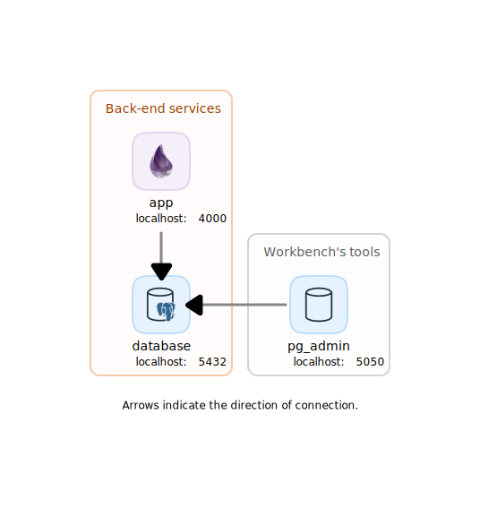

# Lorem Ipsum Project


> **Lorem Ipsum Project** uses a framework to create, develop, and deploy an application on `localhost` with a specific service architecture using Docker containers, without the need to install anything other than [Docker Desktop](https://www.docker.com/products/docker-desktop/). Ensuring an application deployment just like it would run in a network-mounted production environment, with the exception that it is deployed on the local machine.<br/><br/>
> In order to deploy without the framework as normally, navigate to the `./src` directory and consult the application [README.md](./src/README.md) file.

## Table of Contents
- [1. Application](#1-application)
- [2. Framework](#2-framework)
  - [2.1. Arquitecture](#22-arquitecture)
  - [2.2. Deploy](#21-deploy)
  - [2.3. Development](#23-development)
    - [2.3.1. Create a brand new project](#231-create-a-brand-new-project)
    - [2.3.2. Custom deploy commands](#234-custom-deploy-commands)
    - [2.3.3. Set version](#235-set-version)
  - [2.4. Docker](#24-docker)
    - [2.4.1. Login to Docker](#241-login-to-docker)
    - [2.4.2. Prune Docker](#242-prune-docker)

## 1. Application

To consult the application documentation, refer to the [./src/README.md](./src/README.md) file.

## 2. Framework


### 2.1. Arquitecture

| Service  | URL                                     | Description                     |
| :------- | :-------------------------------------- | :------------------------------ |
| app      | [localhost:4000](http://localhost:4000) | API-REST server <br> Web server |
| database | [localhost:5432](http://localhost:5432) | PostgreSQL database server                 |
| pgadmin  | [localhost:5050](http://localhost:5050) | PGAdmin server                  |

<p align="center"></p>

### 2.2. Deploy

1. This step is only required when deploying the service for the first time, a database reset is needed or the database container is detroyed. This command drops the project database (if any), creates a new one and run a seeding script:

    ```sh
    ./app db-reset
    ```

    Once having a configured database, run the following command to deploy the service along with its configured required services and tools.

    ```sh
    ./app up
    ```

### 2.3. Development

#### 2.3.1. Create a brand new project

1. First, is needed to set a name for a new project. Run the following command replacing `<PROJECT_NAME>` with the desired name (Use capital casing with spaces):

    ```sh
    ./app name <PROJECT_NAME>
    ```

1. In order to create a new phoenix project, run the following command:

    ```sh
    ./app init
    ```

    This will generate all the files and apply specific configurations.
    It can accept all option flags from the task `mix phx.new` like `--no-html` or `--no-esbuild` (Full task [phx.new](https://hexdocs.pm/phoenix/Mix.Tasks.Phx.New.html) documentation).

1. Edit the `run.sh` file, adjust the `schemas()` function in order to create a migration generation script. Once saved, run the following command:

    ```sh
    ./app schemas
    ```
    This Generate schema, changesets, context functions, tests and migration files and configures `servers.json` & `pgpass` files with credentials for PGAdmin.

#### 2.3.2. Custom deploy commands

There is the possibility of deploying the service by executing custom server initialization commands, for example, to run the elixir interactive console `iex -S mix phx.server`.

In order to do this, execute the following command, replacing ` [<COMMAND>...]` with the commands to be executed.

```sh
./app run [<COMMAND>...]
```

#### 2.3.3. Set version

Set application version on `src/mix.exs` file and `README.md` version badge.

```sh
./app set-version 0.0.0
```

### 2.4. Docker

#### 2.4.1. Login to Docker

In order to download private Docker images, you need to login to GitHub using a username and a token (classic, not fine-grained) and have access to the resource. To do this, execute the following command:

```sh
./app login <GITHUB_USER> <ACCESS_TOKEN>
```

How to generate token: [Personal Access Token (classic)](https://docs.github.com/en/authentication/keeping-your-account-and-data-secure/managing-your-personal-access-tokens#creating-a-personal-access-token-classic)

#### 2.4.2. Prune Docker

Stops all containers and prune Docker.

```sh
./app prune
```
