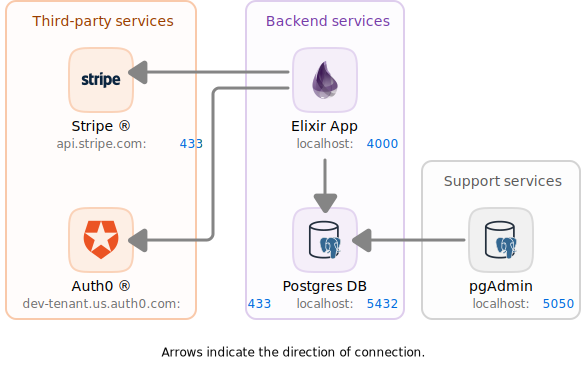

<!-- markdownlint-disable MD033 -->
<!-- markdownlint-disable MD034 -->

# Dockerized Elixir Workbench


[](https://github.com/JosePamplona/Dockerized-Elixir-Workbench/blob/main/LICENSE.md)
[](https://github.com/JosePamplona/Dockerized-Elixir-Workbench/commits/main)

This is a script to create [Elixir](https://elixir-lang.org/) projects with the [Phoenix](https://www.phoenixframework.org/) framework and deploy it on `localhost` with a specific service architecture using Docker containers, without the need to install anything other than [Docker Desktop](https://www.docker.com/products/docker-desktop/). Ensuring an application deployment just like it would run in a network-mounted production environment, with the exception that it is deployed on the local machine.

- [Dockerized Elixir Workbench](#dockerized-elixir-workbench)
  - [Arquitecture](#arquitecture)
  - [Create a new project](#create-a-new-project)
  - [Deployment](#deployment)
  - [Maintenance](#maintenance)
    - [Private Github Registry Images](#private-github-registry-images)
    - [Reset Docker](#reset-docker)
  - [License](#license)

## Arquitecture

<p align="center"></p>

| Service  | URL | Description |
| :-- | :-- | :-- |
| app      | http://localhost:4000 | API-REST & GraphiQL server |
| database | http://localhost:5432 | PostgreSQL database server |
| pgadmin  | http://localhost:5050 | PGAdmin server |
| Stripe  | https://api.stripe.com:433 | Stripe API service |
| Auth0  | https://dev-tenant.us.auth0.com:433 | Auth0 authentication service |

## Create a new project

1. Modify the `config.conf` file in order to configure the project name and creation specifications.

2. Modify the `docker/schemas.sh` file in order to configure the DB.

3. Run the following command:

    ```sh
    ./app new
    ```

    This will generate all the files and apply specific configurations.
    It can accept all option flags from the task `mix phx.new` like `--no-html` or `--no-esbuild` (Full task [phx.new](https://hexdocs.pm/phoenix/Mix.Tasks.Phx.New.html) documentation).

    This command also generate schemas, changesets, context functions, tests and migration files.

## Deployment

1. This step is only required when deploying the service for the first time, a database reset is needed or the database container is detroyed. This command drops the project database (if any), creates a new one and run a seeding script:

    ```sh
    ./app setup --env ENV
    ```

1. Once having a configured database, run the following command to deploy the service along with its configured required services and tools in a (local) production enviroment.

    ```sh
    ./app up --env ENV
    ```

In both commands the flag `--env` is optional. `ENV` corresponds to the desired enviroment configuration to be deployed, by default is `dev`.

### Custom commands <!-- omit in toc -->

There is the possibility of deploying the application by executing custom server initialization commands. For example, to run an elixir interactive console: `iex -S mix phx.server` in the server:

```sh
./app run [COMMAND...]
```

Replace `[COMMAND...]` with the command(s) to be executed. For example:

```sh
./app run iex -S mix phx.server
```

## Maintenance

### Private Github Registry Images

In order to download private github registry images, you need to login to GitHub using a username and a token (classic, not fine-grained) and have the rquired access level to the resource. To do this, execute the following command:

```sh
./app login GITHUB_USER ACCESS_TOKEN
```

Replace `GITHUB_USER` and `ACCESS_TOKEN` with your corresponding user name and token. How to generate a token: [Personal Access Token (classic)](https://docs.github.com/en/authentication/keeping-your-account-and-data-secure/managing-your-personal-access-tokens#creating-a-personal-access-token-classic)

### Reset Docker

Use this command in order to stop all containers and prune Docker. It's like a Docker data reset:

```sh
./app prune
```

## License

This software is released under the [MIT](https://mit-license.org/) license.

Permission is granted to use, copy, modify, and distribute the code in both commercial and non-commercial projects. It only requires that the copyright notice and permission statement be maintained in all copies. No warranties are provided and the authors bear no liability.

Copyright © 2024 José Luis Pamplona Stoever.
