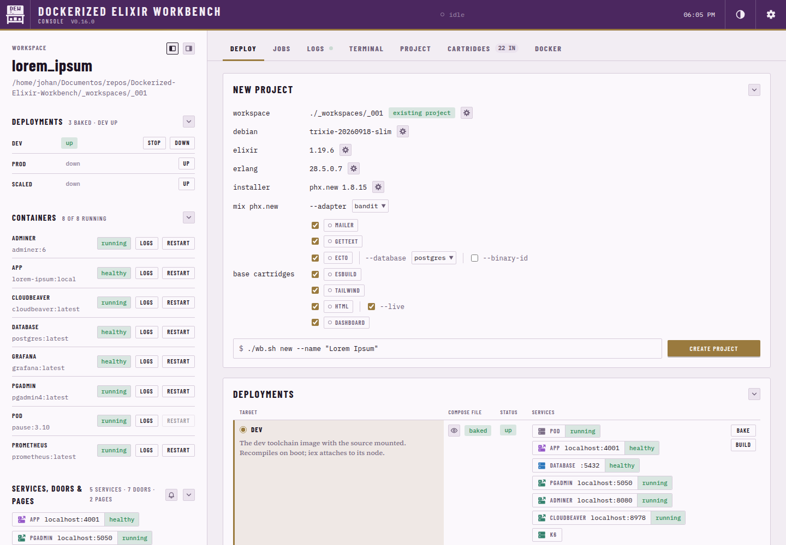
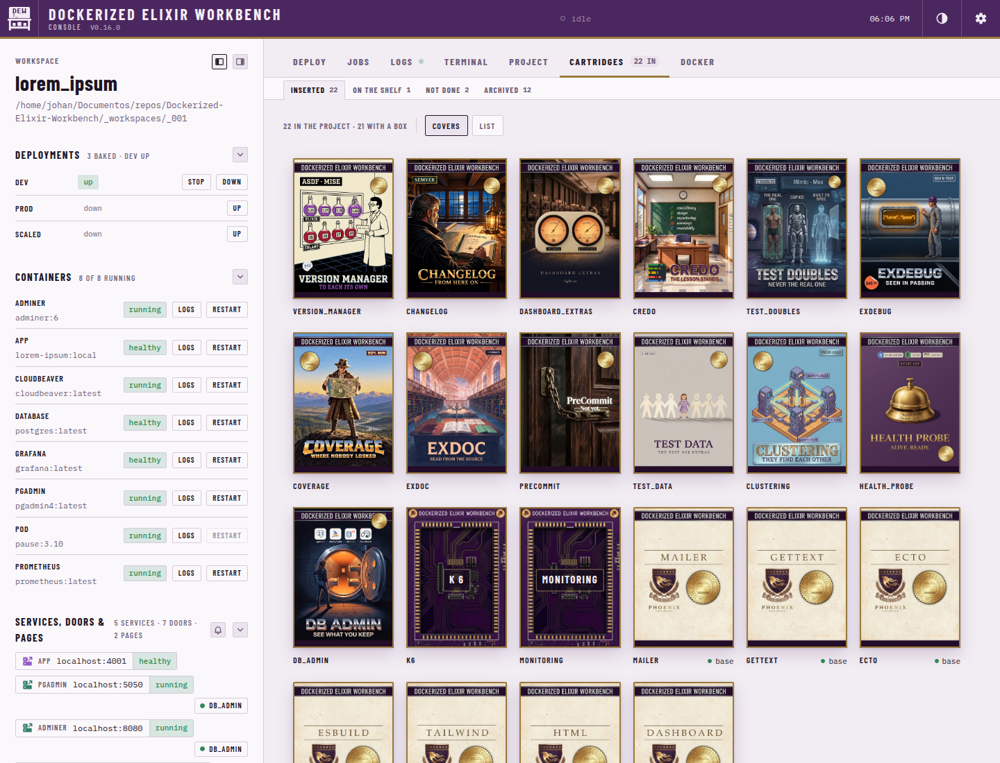

<!-- markdownlint-disable MD033 -->

# Dockerized Elixir Workbench <!-- omit in toc -->

[](https://github.com/JosePamplona/Dockerized-Elixir-Workbench/actions/workflows/ci.yml)

Phoenix projects created and run on `localhost` with nothing installed on the host but Docker. Three parts: `wb.sh`, the script that generates a project into its own workspace and runs every mix and git step in a container; a package of **cartridges** (`igniter/`), features that go into the project as one commit each and come out the same way; and a **console** that drives both from the browser.



## Quickstart

```sh
git clone https://github.com/JosePamplona/Dockerized-Elixir-Workbench.git
cd Dockerized-Elixir-Workbench
./wb.sh console          # builds the workbench image (four minutes, once), then http://localhost:4100
```

In the console, **Create project** generates a stock Phoenix project with its base cartridges and makes its first commit (about two minutes); **Up dev** brings it up, and the rail says on which port it answers — the first free one from `4000`. The same from a shell:

```sh
./wb.sh new --name "My App"  # the project, into the workspace config.conf names (_workspaces/_001)
./wb.sh add exdoc            # a cartridge, as one commit; ./wb.sh catalog lists the shelf
./wb.sh up                   # dev, detached: the boot compiles the project with what was added; ./wb.sh logs follows it
```

Every feature is a **box on the shelf**: a cover, its papers — what it installs, the need it answers, why it is shaped so — and the form of its options. Inserted, it is one commit in the project; ejected, one revert.



## Why it is shaped like this

- **One compose per workspace, and a pod inside it.** A project owns its orchestration, with names and ports baked in, so several run side by side; inside, every service joins one network namespace and reaches the others on `localhost`, so Phoenix's own configuration stays untouched. [The Workspace](#the-workspace), below.
- **A feature is a cartridge: one commit in, one revert out.** What it installs, the need it answers and the reasoning behind it are papers in its own directory. The anatomy: [igniter/lib/workbench_igniter/features/README.md](igniter/lib/workbench_igniter/features/README.md). Three papers to read first: [health_probe](igniter/lib/workbench_igniter/features/health_probe/DESIGN.md) (the reference), [clustering](igniter/lib/workbench_igniter/features/clustering/DESIGN.md) and [ecto](igniter/lib/workbench_igniter/features/ecto/DESIGN.md).
- **The console reads what the project has, and asks it to carry nothing for the console's sake.** Its architecture, as settled: [console/README.md](console/README.md).
- **The record is the CHANGELOG**: what was done and why, decision by decision. [CHANGELOG.md](CHANGELOG.md).

## The Workspace

The workbench stays in its directory and never changes shape. What it builds does — every cartridge and every deployment adds its own containers, routes and edges — so the shape of a project is not described here: each cartridge's README says what it installs and how it is wired, the [deployments](#deployment) say what they bring up, and the workbench itself tells what is there right now (`./wb.sh status`) and what could be (`./wb.sh catalog`). What follows is the part that holds for every project.

A project is generated into its **workspace** (`WORKSPACE_PATH`), which owns its orchestration: a `docker-compose.yml` with the project's name, images and host ports baked in at creation — the first free ones from `4000` (application) and, when the cartridges that bring them are in, `5050` (pgAdmin) and `3000` (Grafana): free meaning nothing listens on them and no other workspace under `_workspaces/` has them in a compose file of its own, so several workspaces run side by side whether or not they were up when the next one was made. `up` refuses, naming the holder, when a port the file publishes is taken meanwhile; the fix is the port line in the file. Inside it the services follow the **pod pattern**: a `pod` container owns the workspace's network namespace and its published ports, and every other service joins it, so they all reach each other on `localhost` and the project keeps Phoenix's default database configuration untouched. The database is never published: it is reachable only from inside its workspace.

### Orchestration files of a workspace

The workspace owns its orchestration. These files are generated into it, and they are the source of truth of how it runs — edit them to change ports, images or services:

| File | What it is |
| :-- | :-- |
| `docker-compose.yml` | **dev** — dev toolchain image with the source mounted. This is the name `docker compose` picks up with no `--file`, so a bare `docker compose up` in the workspace works, with or without the workbench. |
| `docker-compose.prod.yml` | **production** — release image, no source volume, a one-shot `migrate` service the app waits for. Baked at birth with the other two; `bake --deploy prod` writes it again. |
| `docker-compose.scaled.yml` | **scaled** — replicas behind a balancer on a bridge network, four at birth. `bake --deploy scaled --replicas N [--no-balancer]` reshapes it. |
| `Dockerfile.local` | Dev toolchain image. Copied into the project so a clone without the workbench can rebuild the same image. |
| `Dockerfile` | Production image, generated by `mix phx.gen.release --docker` — Phoenix's own, not a workbench template. |

The unsuffixed file is the *development* one for compose and the *production* one for the Dockerfiles. That is not an oversight: each follows its own ecosystem's convention — `docker-compose.yml` is what Compose loads by default and conventionally holds local development, while an unsuffixed `Dockerfile` is what build systems and registries expect for the deployable image.

The three files are the bake's to write, so a hand edit to one of them lasts until the next `bake`. Edits meant to stay go in `docker-compose.override.yml`, which Compose reads on its own beside the dev file and the bake never touches.

## The Console

The workbench has a face: a Phoenix LiveView page that shows the workspace — containers, deployments, git, what is inserted — and drives this script from the browser, cartridges included. It runs as a container of its own, a release on an image built once for the sources as they are, with Docker's socket and the workbench mounted:

```sh
./wb.sh console          # http://localhost:4100, its output here; Ctrl+C takes it down
./wb.sh console up       # the same, left running (./wb.sh console logs, ./wb.sh console down)
./wb.sh console dev      # mix phx.server on the mounted sources, reloading on change, for work on the console
```

Every command it runs is a job in its tray, with the output and exit code `wb.sh` gave, in colour: the console runs this script on a pipe, where mix, hex, git and compose would go plain, so it sets `WB_ANSI=always` and the script asks them for colour anyway. From a terminal, or unset, nothing changes. See [console/README.md](console/README.md).

## Configuration

1. Modify the `./config.conf` file in order to configure the project name, the workspace and the stack the images are built from.
  The file explains every setting above its line, and the console's configuration drawer shows the same text as each field's help.

1. Make sure Docker is running before running any script command: the native [Docker Engine](https://docs.docker.com/engine/) on Linux, [Docker Desktop](https://www.docker.com/products/docker-desktop/) on macOS and Windows.

## Create a new project

1. Run the following command:

    ```sh
    ./wb.sh new --name "Lorem Ipsum"
    ```

    This command generates a **vanilla** project into the workspace: a stock `phx.new` project plus only what the workspace needs to boot it — the endpoint bound to `0.0.0.0`, the `.env`/`.env.sample` files the compose `env_file` requires, and the `.env` entry in `.gitignore`. It also runs `mix phx.gen.release --docker`, which `phx.new` does not: the production `Dockerfile` it generates is what `up --deploy prod` builds from. Finally it bakes the workspace's three compose files and its `Dockerfile.local`.

    It can accept all option flags from the task `mix phx.new` like `--no-html` or `--no-ecto` (Full task [phx.new](https://hexdocs.pm/phoenix/Mix.Tasks.Phx.New.html) documentation).

    `--name` names this creation; without it, `PROJECT_NAME` in `config.conf` does. The app and module derive from it, and so do the workspace's images and its compose project — and once the project exists, its own compose is what every later command reads. `config.conf` names the next project, the workspace and the stack versions: they shape the project generation and the images, not the Elixir configuration. Everything else — docs, coverage, API, checks — arrives afterwards as cartridges with the `add` command, one at a time.

## Deployment

One command deploys the service along with its required services and tools:

```sh
./wb.sh up [--deploy TARGET]
```

The containers run **detached**: the terminal stays free and exiting it does not stop anything. The command prints the application URL. `TARGET` is **dev** (the default), **prod** or **scaled**.

The database needs no step of its own. The dev image creates it, migrates it and runs the seeds on every boot (`mix setup`, Phoenix's own alias), so a reset in dev is `./wb.sh mix ecto.reset`. The release deployments migrate into the database the server created; a reset there is `down` and a fresh volume.

Which server is the ecto cartridge's `--database`: the compose runs a **Postgres** (the default), a **MySQL** or an **SQL Server** as `database`, configured to phx.new's own dev credentials so the project's configuration stays untouched, each with a healthcheck the app and the migrator wait on; the images are `config.conf`'s. SQL Server's image is amd64 only and the compose accepts its licence (`ACCEPT_EULA`); since it creates no database on its own, the release deployments run a one-shot `create` before migrating. On **SQLite** there is no server: dev keeps the file beside the source as phx.new does, and the production deployment mounts a `data` volume for it and migrates as with a server. A scaled deployment refuses SQLite, since replicas cannot share a file.

The production deployment keeps the dev compose's pod layout and swaps the image for the release. Its migrations are a deployment step, not a boot step: a one-shot `migrate` service runs `bin/migrate` (from `phx.gen.release`) to completion and the app's `depends_on` waits for it — the release phase every platform has under its own name (Heroku's release phase, Fly's `release_command`, a Kubernetes `Job`), the same pattern the scaled deployment uses. The database it migrates into, `APP_prod`, is created by the Postgres or MySQL image when its data directory is initialised (SQL Server's by the `create` one-shot, Ecto's other verb beside `migrate`), so a workspace that ran dev first already has it.

The running system is managed with:

```sh
./wb.sh logs [SERVICE...] # Follow the containers logs (Ctrl+C detaches)
./wb.sh ps                # List the workspace containers
./wb.sh stop              # Stop the containers, keeping them for a fast restart
./wb.sh down              # Remove the containers (data volumes survive)
```

Images can be (re)built without deploying with `./wb.sh build [--deploy TARGET] [OPTIONS]` — the dev image from the project's `Dockerfile.local`, or the production release image with `--deploy prod` (`up --deploy prod` also rebuilds it on each deploy). `[OPTIONS]` are passed to `docker compose build`, e.g. `--no-cache`.

### Cluster deployment

```sh
./wb.sh add clustering
./wb.sh up --deploy scaled
```

Deploys **four production replicas that form a real BEAM cluster, behind an nginx balancer**. It is a different compose topology from the one above: the pod pattern is dropped so every replica gets its own IP, and the four share the `app` network alias — Docker's embedded DNS then answers that single name with the four addresses, which is exactly what `DNSCluster` queries through `DNS_CLUSTER_QUERY`. The database is reached by name instead of on `localhost`, and a one-shot `migrate` service runs the migrations before the replicas start.

The balancer publishes the cluster's single entry point. Every replica also publishes its own port, so a **specific** node can still be addressed — which is how cross-node behaviour is demonstrated: open a page on one replica, another on a different one, and watch a broadcast cross.

Whether those replicas form a **cluster** depends on the `clustering` feature. Its `rel/env.sh.eex` is what makes the release boot as a named distributed node; without it the release starts with a short name and `DNSCluster` cannot connect anything, so the compose leaves `DNS_CLUSTER_QUERY` unset and the replicas run isolated.

That is a perfectly valid deployment — replicas behind a balancer is how a stateless application scales, and they need not know each other exists. So the command warns and carries on rather than refusing. Install the feature when you want them connected (PubSub across nodes, Presence, distributed registries); since the distribution is baked into the release image, doing it afterwards means building again.

Look at the cluster from the inside:

```sh
./wb.sh iex --deploy scaled app1   # the release's remote shell on the first replica
```

```elixir
iex> Node.list()
[:"my_app@172.25.0.2", :"my_app@172.25.0.3", :"my_app@172.25.0.5"]
```

And see the balancing without touching the project: the `X-Served-By` header nginx adds is the address of the replica that answered, the same one that shows up in the node name.

```sh
curl -sI http://localhost:4000 | grep X-Served-By
```

Two options shape how the deployment is baked, and `bake` alone takes them — `up`, `build`, `logs`, `ps`, `stop` and `down` act on the file as baked and just need `--deploy scaled`:

| Option | Default |
| --- | --- |
| `bake --deploy scaled --replicas N` | `4` |
| `bake --deploy scaled --no-balancer` | balancer included; publishes only the per-replica ports |

This deployment is meant for seeing the cluster work, not for developing: the source is not mounted and every replica runs the release image.

## Development

These commands run on the **running** app container (`exec`): they enter instantly and exiting them never stops the application.

```sh
./wb.sh iex          # Interactive Elixir shell on the project
./wb.sh mix [ARGS..] # Any mix task, e.g.: mix cover, mix docs, mix test
./wb.sh bash         # Shell inside the app container
```

`mix` also works with the system down: it falls back to a one-off container (starting the database dependency if needed), so tasks like `./wb.sh mix docs` do not require a full deployment.

### Load testing

```sh
./wb.sh add k6
./wb.sh k6 [--deploy TARGET] [SCRIPT] [K6_OPTIONS...]
```

The **k6** cartridge puts [k6](https://k6.io/) in the compose under a profile `up` never starts, with the project's `k6/` directory mounted as its scripts, and installs `k6/smoke.js` to begin with. `./wb.sh k6` runs a script against the deployment that is up — `smoke.js` by default, anything after it goes to `k6 run` (`--vus 20 --duration 1m`). The script reaches the app through `BASE_URL`, which the compose sets for each topology: the app on `localhost` inside the pod, the balancer on the scaled deployment, or the `app` alias — every replica at once — when the balancer is left out. So the same script runs on dev, prod and scaled.

### Monitoring

```sh
./wb.sh add monitoring
```

The **monitoring** cartridge puts [PromEx](https://hexdocs.pm/prom_ex) in the app — the plugins its shape calls for (Application, Beam, Phoenix; Ecto with a repo; LiveView with `phoenix_live_view`), `/metrics` served by the endpoint — and [Prometheus](https://prometheus.io) with [Grafana](https://grafana.com) in the compose. Grafana is published on its own port beside the app's (the first free one from `3000`; `./wb.sh status` and the console say which), signed in already, with a dashboard per plugin: PromEx uploads them when the app starts, and the app waits for Grafana to be there. Each container opens with a file the project owns, `monitoring/prometheus.yml` and `monitoring/grafana/datasource.yml`; what is the topology's — the app on `localhost` inside the pod, one target per replica on the scaled network, where Prometheus and Grafana are — the compose hands over, so the same insert serves dev, prod and scaled. With k6 in, `./wb.sh k6` writes its results to Prometheus too, for Grafana to draw beside the app's.

### Services that are cartridges

Some cartridges bring a container rather than Elixir code: **db_admin** (a database admin in the browser, open on the project's database: `--admin pgadmin`, `phpmyadmin`, `adminer` or `cloudbeaver`, one or several, each with the file it opens with in the workspace; requires ecto, and the project's database decides which can be chosen), **k6**, and **monitoring** (Prometheus and Grafana, beside the PromEx it installs). Each declares the compose services it needs, and `add` bakes them into the three compose files in the insert's own commit; `./wb.sh bake` writes them again for a compose you edited by hand. A vanilla `new` brings the database alone.

### Add features

Workbench features can be installed on the existing project at any time:

```sh
./wb.sh add [FEATURE] [OPTIONS]
```

`[FEATURE]` is a cartridge of the catalog (`./wb.sh catalog`). As of 2026-09-29 the shelf offers **ash**, **changelog**, **clustering**, **coverage**, **credo**, **dashboard_extras**, **db_admin**, **exdebug**, **exdoc**, **health_probe**, **k6**, **monitoring**, **precommit**, **test_data**, **test_doubles** and **version_manager**, plus the seven *base cartridges* below. `[OPTIONS]` are the flags of the corresponding `mix workbench.install.FEATURE` task; the console's Installation screen is the same form.

Two boxes are *pending* — **specdd** and **stripe**: designed and documented, not built, so nothing inserts them yet — and twelve are *archived* (**ansi**, **auth0**, **chiefs_setup**, **dbschema**, **enhancements**, **graphql**, **guidelines**, **health_endpoint**, **mock**, **openai**, **rest**, **toolchain**, retired 2026-09-20 and 2026-09-22): the Phoenix line's boxes, the two a newer box covers — `mock` by `test_doubles` and `health_endpoint` by `health_probe` — and the ones that need an outside account or a team's URL. Each says on its own papers why it went, which is why they stay; `add` refuses them unless `--archived` says so.

**chiefs_setup** was a *collection*: a cartridge whose installer inserts other cartridges — the workbench's picks (the house's settings, the dep-only quintet, REST or GraphQL as its `--interface` says, coverage, exdoc, enhancements and health_endpoint). Adding one inserts each missing member as its own commit, so `eject` still reverts one cartridge alone; the collection leaves no commit of its own. It is archived with the line it collected, and is for now the only collection the shelf has had.

**ansi**, **version_manager**, **toolchain** and **changelog** are what the retired opinionated `new` used to write into every project, one decision each: coloured logs through Docker, the file your version manager reads, so your host switches to this project's Erlang and Elixir when you `cd` into it and to another project's when you leave (`.tool-versions` for asdf, which mise reads too, or `mise.toml` with `--manager mise`), `/.elixir_ls/` ignored, and a `CHANGELOG.md` opened at the project's version, which is where its versioning starts.

The workbench can say all of that itself, and which cartridges the project already carries:

```sh
./wb.sh catalog [--json] # Every cartridge: version, kind, what it installs
./wb.sh status  [--json] # The workspace: ports, baked deployments, containers, installed cartridges
```

Every insert is **one commit** in the workspace (`Insert FEATURE …`, signed as `GIT_IDENTITY` in `config.conf` says), on top of the first commit `new` makes. That is what makes a cartridge removable:

```sh
./wb.sh eject FEATURE       # Reverts the cartridge's commit; refuses if its files changed since
./wb.sh commit [MESSAGE]    # Commits pending changes — `add` needs a clean tree
./wb.sh bake                # Bakes docker-compose.yml again for the project as it is now (one commit)
./wb.sh bake --deploy prod  # The prod (or scaled) compose alone, the image left to build or up (one commit)
./wb.sh bake --deploy scaled --replicas 2 --no-balancer  # Another shape of the scaled deployment; up deploys it as baked
```

**mailer**, **gettext**, **ecto**, **esbuild**, **tailwind**, **html** and **dashboard** are *base cartridges*: what `phx.new` decides at generation time (its `--no-*` flags), added afterwards as `phx.new` itself would have generated it — the difference between the project generated with and without the flag, at the toolchain's Phoenix. A project born with them shows them inserted; one left out at creation (`./wb.sh new --no-live`) is a box on the shelf, to insert later. `ecto` takes `--database postgres|mysql|mssql|sqlite3` and `--binary-id` (`phx.new`'s flags that only Ecto reads); inserting it bakes the database server into the compose in the same commit, and the app container's `mix setup` creates the database at the next `./wb.sh up`. LiveView is `html`'s own `--live`, on by default as in `phx.new`: `./wb.sh add html --no-live` leaves it out, and `./wb.sh add html` on a project born `--no-live` adds it.

A box that is no longer offered is *archived*, not deleted: its papers, its CHANGELOG and its box art stay on the shelf — they are the log of the reasoning that made it, which is worth reading long after the cartridge stops being a pick for a new project. `./wb.sh add` refuses it and names the flag that inserts it anyway, for a hand rebuilding an old project: `./wb.sh add --archived NAME`. Nothing changes for a project that already carries one — it reads as inserted, and ejects — because being archived is a fact of the box and being inserted is a fact of the project. The console counts the archived in the shelf's ribbon, beside *Inserted*, *On the shelf* and *Not done*, and their boxes are the only ones on the plank in black and white: colour there says what you can have.

A cartridge whose options are independent pieces (ash: every option is a package) can be run again with more of them and adds only what is missing; the others are inserted once, with the options of that moment, and changing them means ejecting and inserting again. The catalog says which is which (`rerun`).

Each cartridge answers `status` off the same mark its installer checks before touching anything, so the two never disagree. The `--json` forms (with the installer's options and which box covers exist) are meant for tools driving the workbench, as is the `-y`/`--yes` switch before any command, which answers its confirmations: `./wb.sh --yes delete`.

## Delete project

Use this command for deleting all project files and the Docker compose project:

```sh
./wb.sh delete
```

> ⚠️ **Warning**: This action is destructive. Once executed, the current project files will be deleted, and neither the files nor the docker containers can be recovered. Before proceeding, make sure you are absolutely certain that you want to remove them.

## Maintenance

### Private Github Registry Images

In order to download private github registry images, you need to login to GitHub using a username and a token (classic, not fine-grained) and have the required access level to the resource. To do this, execute the following command:

```sh
./wb.sh login [GITHUB_USER] [ACCESS_TOKEN]
```

Replace `[GITHUB_USER]` and `[ACCESS_TOKEN]` with your corresponding user name and token. How to generate a token: [Personal Access Token (classic)](https://docs.github.com/en/authentication/keeping-your-account-and-data-secure/managing-your-personal-access-tokens#creating-a-personal-access-token-classic)

### Checks

Every push runs the same checks CI does (`.github/workflows/ci.yml`): the two scripts through [ShellCheck](https://www.shellcheck.net/), and each Elixir package — `igniter/`, `console/` — through the formatter, [Credo](https://hexdocs.pm/credo) in strict mode, [Dialyzer](https://hexdocs.pm/dialyxir) and its tests, on the Elixir and OTP its `.tool-versions` names. To run them before pushing:

```sh
shellcheck -x wb.sh scripts/entrypoint.sh
cd igniter && mix format --check-formatted && mix credo --strict && mix dialyzer && mix test
cd console && mix assets.build && mix format --check-formatted && mix credo --strict && mix dialyzer && mix test
```

The first `mix dialyzer` builds the PLT into `priv/plts/` (ignored; CI caches it), which takes a few minutes; the runs after it take seconds. The console's suite reads the bundle esbuild writes (`priv/static/assets/js/app.js`, ignored), so `mix assets.build` comes first on a fresh checkout; CI does the same.

### Other commands

The rest of what `./wb.sh help` lists, one line each:

```sh
./wb.sh adopt                    # Take in a Phoenix project made elsewhere, as it is in the workspace: what new adds after phx.new, as one commit
./wb.sh stacks [use TAG]         # The usable hexpm/elixir images on Docker Hub; 'use' writes one's three versions into config.conf
./wb.sh engine [native|desktop]  # Show or switch the Docker context: on Linux the host's engine and Docker Desktop's VM share nothing
./wb.sh config set KEY=VALUE     # Write into config.conf in place, keeping comments and order
./wb.sh expand CARTRIDGE [OPTS]  # What 'add' would insert, in order, without inserting it
./wb.sh restart [SERVICE...]     # Restart the named services of the deployment that is up
./wb.sh prune [--images|--build] # Remove what no live workspace uses; never this deployment, never the console. Asks first
./wb.sh --yes COMMAND            # Answer every confirmation, for scripts and tools driving the workbench
```

### Help

Shows the workbench script help section:

```sh
./wb.sh help
```

## License

This software is released under the [MIT](https://mit-license.org/) license.

Permission is granted to use, copy, modify, and distribute the code in both commercial and non-commercial projects. It only requires that the copyright notice and permission statement be maintained in all copies. No warranties are provided and the authors bear no liability.

Copyright © 2024-2026 José Luis Pamplona Stoever.
