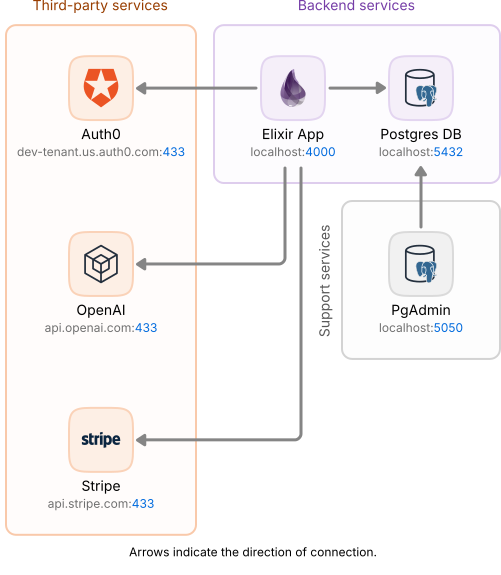

<!-- markdownlint-disable MD033 -->

# Dockerized Elixir Workbench <!-- omit in toc -->


[](https://github.com/JosePamplona/Dockerized-Elixir-Workbench/blob/main/LICENSE.md)
[](https://github.com/JosePamplona/Dockerized-Elixir-Workbench/commits/main)

This is a script for creating [Elixir](https://elixir-lang.org/) projects with the [Phoenix](https://www.phoenixframework.org/) framework and deploying them on `localhost` using a specific service architecture with Docker containers. It eliminates the need to install anything other than [Docker Desktop](https://www.docker.com/products/docker-desktop/) to create, develop, and deploy the project in either a development or production environment.

- [Arquitecture](#arquitecture)
- [Configuration](#configuration)
- [Create a new project](#create-a-new-project)
- [Deployment](#deployment)
  - [Custom entrypoint](#custom-entrypoint)
- [Delete project](#delete-project)
- [Maintenance](#maintenance)
  - [Private Github Registry Images](#private-github-registry-images)
  - [Demo](#demo)
  - [Reset Docker](#reset-docker)
  - [Remove workbench](#remove-workbench)
  - [Help](#help)
- [License](#license)

## Arquitecture

<p align="center"></p>

| Service | URL | Description |
| :-- | :-- | :-- |
| Elixir App | <http://localhost:4000> | API-REST, GraphiQL and/or Web server |
| Postgres DB | <http://localhost:5432> | Relational database server |
| pgAdmin | <http://localhost:5050> | Database management tool |
| Auth0 | <https://dev-tenant.us.auth0.com:433> | Identity management platform |
| Open AI | <https://api.openai.com/v1:433> | AI Assistant service |
| Stripe | <https://api.stripe.com:433> | Payment service provider |

## Configuration

1. Give execution permissions to `./app.sh` file (This step only needs to be performed once):

    ```sh
    sudo chmod +x app.sh
    ```

1. Modify the `./config.conf` file in order to configure the project name and creation specifications.
  For complete configuration instruccions consult: [Configuration File](./CONFIG.md).

1. Make sure [Docker Desktop](https://www.docker.com/products/docker-desktop/) is running before running any script command.

## Create a new project

1. Run the following command:

    ```sh
    ./app.sh new
    ```

    This command generates schemas, changesets, context functions, tests, and migration files when applicable and apply specific configurations.

    It can accept all option flags from the task `mix phx.new` like `--no-html` or `--no-ecto` (Full task [phx.new](https://hexdocs.pm/phoenix/Mix.Tasks.Phx.New.html) documentation).

## Deployment

1. This step is only required when deploying the service for the first time, a database reset is needed or the database container is detroyed. This command drops the project database (if any), creates a new one and run a seeding script:

    ```sh
    ./app.sh setup [-e, --env ENV]
    ```

1. Once having a configured database, run the following command to deploy the service along with its configured required services and tools.

    ```sh
    ./app.sh up [-e, --env ENV]
    ```

In both commands the flag `[-e, --env ENV]` is optional. The argument `ENV` can be **dev**, **prod** or other, it corresponds to the desired enviroment configuration to be deployed, by default is **dev**.

### Custom entrypoint

There is the possibility of deploying the application by executing custom server initialization commands:

```sh
./app.sh run [ARGS...]
```

Replace `[ARGS...]` with the command(s) to be executed. For example, to run an elixir interactive console:

```sh
./app.sh run iex -S mix phx.server
```

## Delete project

Use this command for deleting all project files and the Docker compose project:

```sh
./app.sh delete
```

> ⚠️ **Warning**: This action is destructive. Once executed, the current project files will be deleted, and neither the files nor the docker containers can be recovered. Before proceeding, make sure you are absolutely certain that you want to remove them.

## Maintenance

### Private Github Registry Images

In order to download private github registry images, you need to login to GitHub using a username and a token (classic, not fine-grained) and have the rquired access level to the resource. To do this, execute the following command:

```sh
./app.sh login [GITHUB_USER] [ACCESS_TOKEN]
```

Replace `[GITHUB_USER]` and `[ACCESS_TOKEN]` with your corresponding user name and token. How to generate a token: [Personal Access Token (classic)](https://docs.github.com/en/authentication/keeping-your-account-and-data-secure/managing-your-personal-access-tokens#creating-a-personal-access-token-classic)

### Demo

This command runs the **new**, **setup**, **up**, and **delete** commands consecutively for demonstration purposes:

```sh
./app.sh demo [-e, --env ENV]
```

The flag `[-e, --env ENV]` is optional. The argument `ENV` can be **dev**, **prod** or other, it corresponds to the desired enviroment configuration to be deployed, by default is **dev**.

> ⚠️ **Warning**: This action is destructive. Once executed, the current project files (if any) will be deleted, new ones will be created and finally deleted again and cannot be recovered. Before proceeding, make sure is safe to remove them if there is any.

### Reset Docker

Use this command in order to stop all containers and prune Docker. It's like a Docker data brute-force reset:

```sh
./app.sh prune
```

> ⚠️ **Warning**: This action is destructive. Once executed, all Docker resources (not just the project's resources, but ALL resources in Docker) images, containers, volumes, networks, cache, etc.) will no longer exist and cannot be recovered, only rebuilt. Before proceeding, make sure you are absolutely certain that you want to remove them.

### Remove workbench

Removes the workbench script along with all its files and configurations from the generated project, leaving no trace, as if it had never been there.

```sh
./app.sh remove-workbench
```

> 🛑 **Critical Action**: This operation is irreversible! Once executed, the workbench script files and configurations will be permanently deleted and cannot be recovered. Before proceeding, please ensure you are absolutely certain about this action and proceed with extreme caution.

### Help

Shows the workbech script help section:

```sh
./app.sh help
```

## License

This software is released under the [MIT](https://mit-license.org/) license.

Permission is granted to use, copy, modify, and distribute the code in both commercial and non-commercial projects. It only requires that the copyright notice and permission statement be maintained in all copies. No warranties are provided and the authors bear no liability.

Copyright © 2024 José Luis Pamplona Stoever.
