<!-- markdownlint-disable MD024 -->
<!-- markdownlint-configure-file { "MD033": { "allowed_elements": ["img", "br"] } } -->
# Dockerized Elixir Workbench <!-- omit in toc -->

[](https://github.com/JosePamplona/Dockerized-Elixir-Workbench/blob/main/LICENSE.md)
[](https://github.com/JosePamplona/Dockerized-Elixir-Workbench/releases/latest)
[](https://github.com/JosePamplona/Dockerized-Elixir-Workbench/commits/main)
[](https://github.com/JosePamplona/Dockerized-Elixir-Workbench/actions/workflows/ci.yml)


The workbench is two things in one repository.

1. **A portable development environment for Phoenix.** You create a project and run it on `localhost` with nothing installed on the host but Docker: no Elixir, no Erlang, no Node, no database server. The project carries its own Docker files, so a teammate who clones it gets the same environment you have.
2. **A knowledge base of the Elixir ecosystem, kept as cartridges.** A *cartridge* is one configuration or implementation (static analysis, health probes, clustering, a database admin) packaged together with the papers that explain it: what it installs, the need it answers and why it is designed that way, with sources. Writing a cartridge makes you learn the theory behind it. After that it goes into any future project as one commit, and its papers and the files it wrote stay there to read when you need to remember how it works.

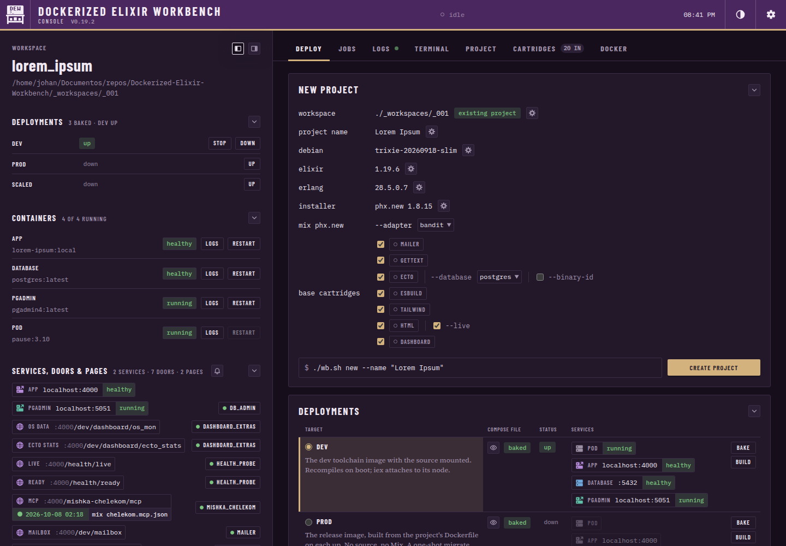

It has three parts, and this README presents them in order, so each section only uses what an earlier one explained:

- **`wb.sh`**, a shell script that creates projects and runs every mix and git step inside a container.
- **The cartridges** (`igniter/`), a package of [Igniter](https://hexdocs.pm/igniter) installers that patch a project through its AST.
- **The console** (`console/`), a Phoenix LiveView application that drives both from the browser.

## Table of Contents <!-- omit in toc -->

- [What it is good for](#what-it-is-good-for)
- [Quickstart](#quickstart)
- [The Workbench \& its Workspace](#the-workbench--its-workspace)
  - [Configuration](#configuration)
  - [Deployments](#deployments)
  - [Commands](#commands)
- [Cartridges](#cartridges)
  - [One commit in, one revert out](#one-commit-in-one-revert-out)
  - [The papers](#the-papers)
  - [The shelf](#the-shelf)
  - [Base cartridges, collections, archived and pending boxes](#base-cartridges-collections-archived-and-pending-boxes)
- [The Console](#the-console)
  - [The Rail](#the-rail)
  - [Deploy](#deploy)
  - [Jobs](#jobs)
  - [Logs](#logs)
  - [Terminal](#terminal)
  - [Project](#project)
  - [The Cartridges tab](#the-cartridges-tab)
  - [Docker](#docker)
  - [Settings](#settings)
- [Writing a cartridge](#writing-a-cartridge)
  - [By hand, for now](#by-hand-for-now)
  - [The box art](#the-box-art)
- [Why it is shaped like this](#why-it-is-shaped-like-this)
- [Maintenance](#maintenance)
- [License](#license)

---

## What it is good for

Four uses, each with the place in this document that shows it.

- **Learning and teaching Elixir and Phoenix.** Every cartridge explains itself: the need it answers, what it installs and why, with sources, and then the code it wrote in your project, as a diff. The same shelf works at three sizes. For one person it is a record of what you learned, kept in a form that runs. For a team it is onboarding: a new developer sees how the project was born, what each package is for and which cartridge brought it. For a class it is the material.
  See [The papers](#the-papers), the Manual and Files screens of [The Cartridges tab](#the-cartridges-tab), and the Birth paper of [Project](#project).
- **Reusing what you worked out.** A setup you got right once becomes a cartridge, and goes into the next project as a commit instead of being copied from the last one. It can be a library with its configuration, a service in the compose, or a whole architecture as a collection of cartridges. A design system would be the same thing, though no cartridge ships one today. Unlike a starter template, a cartridge goes into a project that already exists, and comes out again.
  See [One commit in, one revert out](#one-commit-in-one-revert-out) and [Base cartridges, collections, archived and pending boxes](#base-cartridges-collections-archived-and-pending-boxes).
- **Evaluating before adopting.** Insert a cartridge, read its diff, run it, and eject it with one revert if it is not what you wanted. Some boxes put the alternatives side by side as options (four database admins, two test-double libraries, four databases). The three deployments show the result in development, as a release and as a cluster, and `k6` and `monitoring` measure it.
  See the Installation screen of [The Cartridges tab](#the-cartridges-tab), [Deployments](#deployments) and [The shelf](#the-shelf).
- **Understanding what you run, whoever wrote it.** Code is cheap to generate now, and understanding it is not. A change an assistant produces is different every time and arrives without its reasons. A cartridge is the other kind of object: the same installer makes the same change, it has a version, and its reasoning is written beside it with the sources. A person can insert it or an agent can (`./wb.sh catalog --json --brief` and `status --json --brief` exist so an agent can read the workbench), and either way the result is a commit you can read, explain and revert.
  Writing a cartridge is where the learning is forced: its `DESIGN.md` cannot be written without knowing why. Using one forces nothing, but it leaves the explanation next to the code for the day you need it.
  See [Writing a cartridge](#writing-a-cartridge) and [Why it is shaped like this](#why-it-is-shaped-like-this).

One limit to know from the start: your own cartridges live in the workbench's repository, so a personal shelf or a team's is a fork of it.

---

## Quickstart

You need [Docker](https://docs.docker.com/get-started/get-docker/) running and a bash shell to start the script from. Nothing else. The workbench has been tested on Linux; trying it on macOS and Windows is still pending.

On Linux, use the native Docker Engine. Docker Desktop works too, but it builds images much more slowly: measured once on the same machine, the workbench image took about two and a half minutes on the Engine and fourteen on Desktop, while compiling and running tests took the same on both. `./wb.sh engine native` selects it.

```sh
git clone https://github.com/JosePamplona/Dockerized-Elixir-Workbench.git
cd Dockerized-Elixir-Workbench
./wb.sh console          # builds the workbench image (about four minutes, once), then http://localhost:4100
```

In the console, press **Create project** and then **Up** on the `dev` row. The rail on the left shows the address the application answers on, the first free port from `4000`.

The same from a shell, without the console:

```sh
./wb.sh new --name "My App"  # a stock Phoenix project, into the workspace config.conf names
./wb.sh up                   # dev, detached; ./wb.sh logs follows it
```

That is a stock Phoenix application, running. What goes into it next is the subject of [Cartridges](#cartridges).

---

## The Workbench & its Workspace

Two words are used through the rest of this document.

- The **workbench** is this repository. It stays in its directory and never changes shape, whatever you build with it.
- A **workspace** is the directory a project is generated into. It holds the project's source, its git repository and its own Docker files, with the project's name and host ports written into them. Because each workspace owns its orchestration, several projects run side by side.

Workspaces go under `_workspaces/` by default, but nothing requires it. `WORKSPACE_PATH` takes any path, relative to the workbench or absolute, so a project can live next to your other repositories.

```text
Dockerized-Elixir-Workbench/
├── wb.sh              the CLI
├── config.conf        what the next project gets: workspace, name, stack versions
├── igniter/           the cartridges
├── console/           the console
└── _workspaces/
    ├── _001/          a workspace: one Phoenix project, its compose files, its git history
    └── _002/          another one, running beside it on its own ports
```

Every command runs in a container on the *workbench image*, which carries the Elixir toolchain, the Phoenix installer and the Docker CLI. That is why the host needs nothing but Docker: `mix phx.new`, `mix deps.get`, the cartridges' installers and even `git commit` happen inside it.

A project does not depend on the workbench afterwards. The workspace is an ordinary Phoenix repository with an ordinary `docker-compose.yml`, so `docker compose up` works in it with or without the workbench. The only trace is one conditional line in `mix.exs`, which makes the cartridges' Mix tasks available while the workbench is mounted and adds nothing when it is not.

### Configuration

`config.conf` is the one configuration file. Each setting is explained above its line in the file itself. It decides what the *next* project gets. An existing project is described by its own files, never by this one.

| Setting | What it decides |
| :-- | :-- |
| `WORKSPACE_PATH` | The directory the project is generated into, and the workspace every command acts on. Any path, relative to the workbench or absolute. |
| `PROJECT_NAME` | The name of the next project. The OTP app, the module, the images and the compose project derive from it. |
| `ELIXIR_VERSION`, `ERLANG_VERSION`, `DEBIAN_VERSION` | The stack: the three parts of one [`hexpm/elixir`](https://hub.docker.com/r/hexpm/elixir/tags) image tag. `./wb.sh stacks` lists the usable ones. |
| `PHX_NEW_VERSION`, `NODE_VERSION` | The Phoenix installer to generate with (empty takes the newest that runs on the stack) and the Node major. |
| `GIT_IDENTITY` | Who signs the commits the workbench makes in the workspace: your host identity or the workbench's own. |
| `JOB_NICENESS` | The CPU priority of what compiles, so the machine stays usable meanwhile. |
| `*_IMAGE_VERSION` | The image tags of the services cartridges bring: Postgres, MySQL, pgAdmin, nginx, Grafana and the rest. |

There is no port setting. Each workspace takes the first free host ports when it is created and writes them into its own compose file, which is where you change them. A port counts as taken when something is listening on it, or when another workspace under `_workspaces/` has it in a compose file, running or not. A workspace kept elsewhere gets only the first of those two checks.

### Deployments

A project is born with three ways to run, each one a compose file in the workspace. A *deployment* is one of them, brought up.

| Deployment | Compose file | What it runs |
| :-- | :-- | :-- |
| **dev** | `docker-compose.yml` | The dev toolchain image with the source mounted. It recompiles on change, and creates, migrates and seeds the database on boot (`mix setup`). |
| **prod** | `docker-compose.prod.yml` | The release image, built from the project's `Dockerfile` (Phoenix's own, from `mix phx.gen.release --docker`). A one-shot `migrate` service runs first and the app waits for it. |
| **scaled** | `docker-compose.scaled.yml` | Several release replicas behind an nginx balancer, four by default. With the `clustering` cartridge inserted they form a real BEAM cluster. |

In **dev** and **prod** the services follow the *pod pattern*: one `pod` container owns the network namespace and the published ports, and every other service joins it. They all reach each other on `localhost`, so the project keeps Phoenix's default configuration untouched (the database is at `localhost:5432`, as `phx.new` wrote it). The database port is never published to the host.

**scaled** drops the pod so every replica gets its own address. The replicas share one DNS name, which is what `DNSCluster` queries to find its peers.

Writing a compose file from the project as it is now is called *baking*. The workbench bakes on its own whenever a cartridge adds or removes a service. Hand edits meant to survive the next bake go in `docker-compose.override.yml`, which Compose reads by itself and the workbench never touches.

### Commands

`./wb.sh help` documents every command and option. This is the map:

| Group | Commands | What they do |
| :-- | :-- | :-- |
| Create | `new`, `adopt`, `delete` | Generate a project, take in a Phoenix project made elsewhere, delete the workspace's project. |
| Run | `up`, `stop`, `down`, `restart`, `ps`, `logs`, `build`, `bake` | Bring a deployment up or down (`--deploy dev\|prod\|scaled`), follow it, rebuild its image, write its compose file again. |
| Work inside | `mix`, `iex`, `bash`, `k6` | Run a mix task, open IEx on the running node, open a shell, run a load test. |
| Cartridges | `catalog`, `status`, `add`, `eject`, `expand` | List the cartridges, say what the project carries, insert one, remove one, preview an insert. |
| Git | `commit`, `discard` | Commit or throw away the pending changes of the workspace. |
| Workbench | `console`, `config set`, `stacks`, `engine`, `prune`, `login` | Run the console, edit `config.conf`, pick a stack, switch Docker context, clean up, log in to a private registry. |

`./wb.sh --yes COMMAND` answers every confirmation, for scripts. `status --json` and `catalog --json` are the machine-readable forms, the ones the console reads.

---

## Cartridges

A cartridge is one feature a project can take: a library with its configuration, a piece of code, a service in the compose file, or all three. Technically it is an [Igniter](https://hexdocs.pm/igniter) installer, a Mix task that edits the project through its AST instead of with text substitution, so it finds the right place in *your* `mix.exs`, endpoint or router even after you changed them.

The name comes from how it is used: you take a box off a shelf, read what it says, insert it, and take it out again if it was not what you wanted.

### One commit in, one revert out

```sh
./wb.sh add health_probe     # one commit: "Insert health_probe"
./wb.sh eject health_probe   # reverts that commit
```

Every insert is exactly one commit in the workspace's git history. That gives three things for free:

- **You can read what it did.** The commit's diff is the complete list of files the cartridge wrote or changed.
- **You can undo it.** `eject` reverts the commit, and refuses if you changed those files since, or if another cartridge builds on it.
- **It can be asked whether it is there.** Each cartridge answers `status` by looking at the same mark its installer checks before touching anything, so the two never disagree.

A cartridge that brings a container (a database admin, Prometheus) also declares its compose services, and they are baked into the three compose files in that same commit.

### The papers

This is the knowledge-base half. Each cartridge is a directory under [`igniter/lib/workbench_igniter/features/`](igniter/lib/workbench_igniter/features/), and beside its code it keeps four papers:

| Paper | What it answers |
| :-- | :-- |
| `NEED.md` | The developer's situation in one sentence, then *Before*, *After* and *Not for*. It is what the box says on its front. |
| `README.md` | What it installs, its options and how it is wired, file by file. |
| `DESIGN.md` | Why it is built this way: the problem, the background with primary sources quoted, each decision with the alternatives it beat, what was verified and what was not. |
| `CHANGELOG.md` | The cartridge's own versions, with semver applied to what it *installs*. |

The `DESIGN.md` is the one that takes work, and it is the point. To write that [health_probe](igniter/lib/workbench_igniter/features/health_probe/DESIGN.md) answers liveness and readiness on two routes from the first plug of the endpoint, you have to read what Kubernetes, Fly.io and AWS ECS actually do with each answer. Months later the cartridge inserts in seconds, and the paper is still there for whoever wants to know why. Three good ones to start with: [health_probe](igniter/lib/workbench_igniter/features/health_probe/DESIGN.md), [clustering](igniter/lib/workbench_igniter/features/clustering/DESIGN.md) and [ecto](igniter/lib/workbench_igniter/features/ecto/DESIGN.md).

### The shelf

The cartridges on offer today, one to a row. The cover links to the cartridge's directory, and the last column to its papers.

<!-- shelf:start -->

**On the shelf** — 16 cartridges, inserted when the project asks for them:

| Box&nbsp;cover | Cartridge | What it installs | Papers |
| :-: | --- | --- | --- |
| [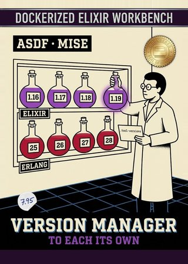](igniter/lib/workbench_igniter/features/version_manager/) | **version_manager**<br>`v0.1.0` | Pins the Erlang and Elixir the project runs on, for the host's version manager | [README](igniter/lib/workbench_igniter/features/version_manager/README.md)<br>[NEED](igniter/lib/workbench_igniter/features/version_manager/NEED.md)<br>[DESIGN](igniter/lib/workbench_igniter/features/version_manager/DESIGN.md)<br>[CHANGELOG](igniter/lib/workbench_igniter/features/version_manager/CHANGELOG.md) |
| [](igniter/lib/workbench_igniter/features/changelog/) | **changelog**<br>`v0.5.2` | Starts versioning in the project: a changelog opened at the version it is on; the mix version task and the README badge on request | [README](igniter/lib/workbench_igniter/features/changelog/README.md)<br>[NEED](igniter/lib/workbench_igniter/features/changelog/NEED.md)<br>[DESIGN](igniter/lib/workbench_igniter/features/changelog/DESIGN.md)<br>[CHANGELOG](igniter/lib/workbench_igniter/features/changelog/CHANGELOG.md) |
| [](igniter/lib/workbench_igniter/features/dashboard_extras/) | **dashboard_extras**<br>`v0.1.0` | Switches on LiveDashboard's OS Data and Ecto Stats pages | [README](igniter/lib/workbench_igniter/features/dashboard_extras/README.md)<br>[NEED](igniter/lib/workbench_igniter/features/dashboard_extras/NEED.md)<br>[DESIGN](igniter/lib/workbench_igniter/features/dashboard_extras/DESIGN.md)<br>[CHANGELOG](igniter/lib/workbench_igniter/features/dashboard_extras/CHANGELOG.md) |
| [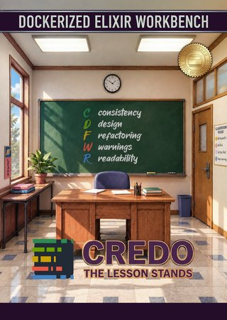](igniter/lib/workbench_igniter/features/credo/) | **credo**<br>`v0.2.0` | Adds Credo static code analysis to the project | [README](igniter/lib/workbench_igniter/features/credo/README.md)<br>[NEED](igniter/lib/workbench_igniter/features/credo/NEED.md)<br>[DESIGN](igniter/lib/workbench_igniter/features/credo/DESIGN.md)<br>[CHANGELOG](igniter/lib/workbench_igniter/features/credo/CHANGELOG.md) |
| [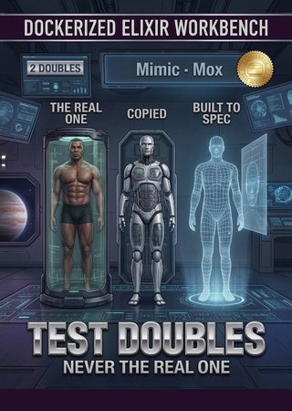](igniter/lib/workbench_igniter/features/test_doubles/) | **test_doubles**<br>`v0.1.1` | Installs the test double libraries: Mimic, Mox, or both | [README](igniter/lib/workbench_igniter/features/test_doubles/README.md)<br>[NEED](igniter/lib/workbench_igniter/features/test_doubles/NEED.md)<br>[DESIGN](igniter/lib/workbench_igniter/features/test_doubles/DESIGN.md)<br>[CHANGELOG](igniter/lib/workbench_igniter/features/test_doubles/CHANGELOG.md) |
| [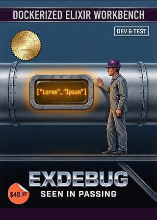](igniter/lib/workbench_igniter/features/exdebug/) | **exdebug**<br>`v0.1.0` | Installs ExDebug: a framed look at what passes through a pipeline, printed in :dev and :test only | [README](igniter/lib/workbench_igniter/features/exdebug/README.md)<br>[NEED](igniter/lib/workbench_igniter/features/exdebug/NEED.md)<br>[DESIGN](igniter/lib/workbench_igniter/features/exdebug/DESIGN.md)<br>[CHANGELOG](igniter/lib/workbench_igniter/features/exdebug/CHANGELOG.md) |
| [](igniter/lib/workbench_igniter/features/coverage/) | **coverage**<br>`v0.12.0` | Adds test coverage reports to the project, measured by ExCoveralls | [README](igniter/lib/workbench_igniter/features/coverage/README.md)<br>[NEED](igniter/lib/workbench_igniter/features/coverage/NEED.md)<br>[DESIGN](igniter/lib/workbench_igniter/features/coverage/DESIGN.md)<br>[CHANGELOG](igniter/lib/workbench_igniter/features/coverage/CHANGELOG.md) |
| [](igniter/lib/workbench_igniter/features/exdoc/) | **exdoc**<br>`v0.9.1` | Adds the ExDoc documentation site to the project | [README](igniter/lib/workbench_igniter/features/exdoc/README.md)<br>[NEED](igniter/lib/workbench_igniter/features/exdoc/NEED.md)<br>[DESIGN](igniter/lib/workbench_igniter/features/exdoc/DESIGN.md)<br>[CHANGELOG](igniter/lib/workbench_igniter/features/exdoc/CHANGELOG.md) |
| [](igniter/lib/workbench_igniter/features/precommit/) | **precommit**<br>`v0.1.3` | Runs the project's checks before the commit exists | [README](igniter/lib/workbench_igniter/features/precommit/README.md)<br>[NEED](igniter/lib/workbench_igniter/features/precommit/NEED.md)<br>[DESIGN](igniter/lib/workbench_igniter/features/precommit/DESIGN.md)<br>[CHANGELOG](igniter/lib/workbench_igniter/features/precommit/CHANGELOG.md) |
| [](igniter/lib/workbench_igniter/features/test_data/) | **test_data**<br>`v0.1.1` | Adds test factories and Faker, shaped by the project's line | [README](igniter/lib/workbench_igniter/features/test_data/README.md)<br>[NEED](igniter/lib/workbench_igniter/features/test_data/NEED.md)<br>[DESIGN](igniter/lib/workbench_igniter/features/test_data/DESIGN.md)<br>[CHANGELOG](igniter/lib/workbench_igniter/features/test_data/CHANGELOG.md) |
| [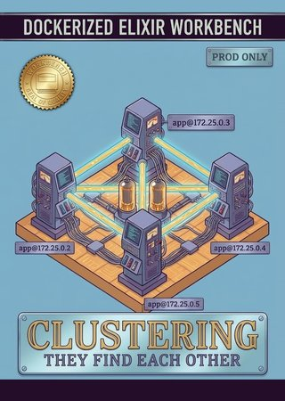](igniter/lib/workbench_igniter/features/clustering/) | **clustering**<br>`v0.2.1` | Boots the production release as a distributed node for DNSCluster | [README](igniter/lib/workbench_igniter/features/clustering/README.md)<br>[NEED](igniter/lib/workbench_igniter/features/clustering/NEED.md)<br>[DESIGN](igniter/lib/workbench_igniter/features/clustering/DESIGN.md)<br>[CHANGELOG](igniter/lib/workbench_igniter/features/clustering/CHANGELOG.md) |
| [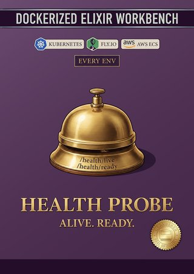](igniter/lib/workbench_igniter/features/health_probe/) | **health_probe**<br>`v0.2.1` | Adds liveness and readiness probes as the first plug of the endpoint | [README](igniter/lib/workbench_igniter/features/health_probe/README.md)<br>[NEED](igniter/lib/workbench_igniter/features/health_probe/NEED.md)<br>[DESIGN](igniter/lib/workbench_igniter/features/health_probe/DESIGN.md)<br>[CHANGELOG](igniter/lib/workbench_igniter/features/health_probe/CHANGELOG.md) |
| [](igniter/lib/workbench_igniter/features/ash/) | **ash**<br>`v0.9.0` | Installs the Ash framework, configured like ash-hq.org's installer for an existing app | [README](igniter/lib/workbench_igniter/features/ash/README.md)<br>[NEED](igniter/lib/workbench_igniter/features/ash/NEED.md)<br>[DESIGN](igniter/lib/workbench_igniter/features/ash/DESIGN.md)<br>[CHANGELOG](igniter/lib/workbench_igniter/features/ash/CHANGELOG.md) |
| [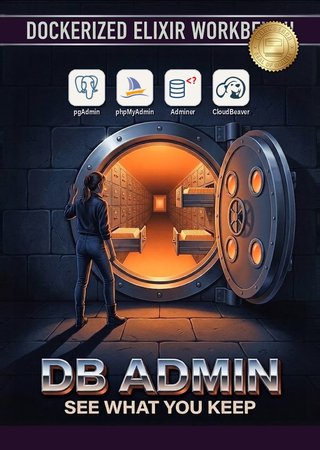](igniter/lib/workbench_igniter/features/db_admin/) | **db_admin**<br>`v0.2.1` | Adds a database admin to the workspace, open on the project's database | [README](igniter/lib/workbench_igniter/features/db_admin/README.md)<br>[NEED](igniter/lib/workbench_igniter/features/db_admin/NEED.md)<br>[DESIGN](igniter/lib/workbench_igniter/features/db_admin/DESIGN.md)<br>[CHANGELOG](igniter/lib/workbench_igniter/features/db_admin/CHANGELOG.md) |
| [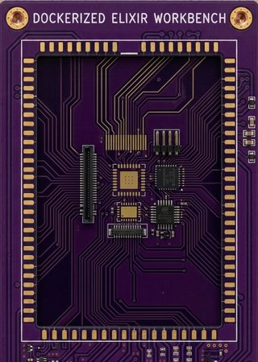](igniter/lib/workbench_igniter/features/k6/) | **k6**<br>`v0.1.0` | Adds k6 load testing to the workspace, with a smoke test to start from | [README](igniter/lib/workbench_igniter/features/k6/README.md)<br>[NEED](igniter/lib/workbench_igniter/features/k6/NEED.md)<br>[CHANGELOG](igniter/lib/workbench_igniter/features/k6/CHANGELOG.md) |
| [](igniter/lib/workbench_igniter/features/monitoring/) | **monitoring**<br>`v0.1.0` | Adds PromEx to the app, and Prometheus with Grafana to the workspace | [README](igniter/lib/workbench_igniter/features/monitoring/README.md)<br>[NEED](igniter/lib/workbench_igniter/features/monitoring/NEED.md)<br>[DESIGN](igniter/lib/workbench_igniter/features/monitoring/DESIGN.md)<br>[CHANGELOG](igniter/lib/workbench_igniter/features/monitoring/CHANGELOG.md) |

**Base cartridges** — the 7 capabilities `phx.new` decides at birth, each one addable afterwards:

| Box&nbsp;cover | Cartridge | What it installs | Papers |
| :-: | --- | --- | --- |
| [](igniter/lib/workbench_igniter/features/mailer/) | **mailer**<br>`v0.3.0` | Adds Phoenix's Swoosh mailer, as phx.new would have generated it | [README](igniter/lib/workbench_igniter/features/mailer/README.md)<br>[NEED](igniter/lib/workbench_igniter/features/mailer/NEED.md)<br>[DESIGN](igniter/lib/workbench_igniter/features/mailer/DESIGN.md)<br>[CHANGELOG](igniter/lib/workbench_igniter/features/mailer/CHANGELOG.md) |
| [](igniter/lib/workbench_igniter/features/gettext/) | **gettext**<br>`v0.2.0` | Adds Phoenix's gettext, as phx.new would have generated it | [README](igniter/lib/workbench_igniter/features/gettext/README.md)<br>[NEED](igniter/lib/workbench_igniter/features/gettext/NEED.md)<br>[DESIGN](igniter/lib/workbench_igniter/features/gettext/DESIGN.md)<br>[CHANGELOG](igniter/lib/workbench_igniter/features/gettext/CHANGELOG.md) |
| [](igniter/lib/workbench_igniter/features/ecto/) | **ecto**<br>`v0.3.1` | Adds Phoenix's Ecto with a database adapter, as phx.new would have generated it | [README](igniter/lib/workbench_igniter/features/ecto/README.md)<br>[NEED](igniter/lib/workbench_igniter/features/ecto/NEED.md)<br>[DESIGN](igniter/lib/workbench_igniter/features/ecto/DESIGN.md)<br>[CHANGELOG](igniter/lib/workbench_igniter/features/ecto/CHANGELOG.md) |
| [](igniter/lib/workbench_igniter/features/esbuild/) | **esbuild**<br>`v0.2.0` | Adds Phoenix's esbuild JavaScript bundling, as phx.new would have generated it | [README](igniter/lib/workbench_igniter/features/esbuild/README.md)<br>[NEED](igniter/lib/workbench_igniter/features/esbuild/NEED.md)<br>[DESIGN](igniter/lib/workbench_igniter/features/esbuild/DESIGN.md)<br>[CHANGELOG](igniter/lib/workbench_igniter/features/esbuild/CHANGELOG.md) |
| [](igniter/lib/workbench_igniter/features/tailwind/) | **tailwind**<br>`v0.2.0` | Adds Phoenix's Tailwind CSS pipeline, as phx.new would have generated it | [README](igniter/lib/workbench_igniter/features/tailwind/README.md)<br>[NEED](igniter/lib/workbench_igniter/features/tailwind/NEED.md)<br>[DESIGN](igniter/lib/workbench_igniter/features/tailwind/DESIGN.md)<br>[CHANGELOG](igniter/lib/workbench_igniter/features/tailwind/CHANGELOG.md) |
| [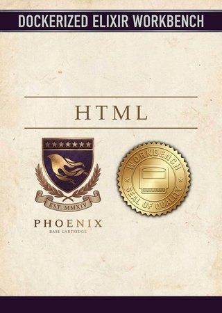](igniter/lib/workbench_igniter/features/html/) | **html**<br>`v0.3.0` | Adds Phoenix's HTML views, as phx.new would have generated them | [README](igniter/lib/workbench_igniter/features/html/README.md)<br>[NEED](igniter/lib/workbench_igniter/features/html/NEED.md)<br>[DESIGN](igniter/lib/workbench_igniter/features/html/DESIGN.md)<br>[CHANGELOG](igniter/lib/workbench_igniter/features/html/CHANGELOG.md) |
| [](igniter/lib/workbench_igniter/features/dashboard/) | **dashboard**<br>`v0.2.0` | Adds Phoenix LiveDashboard, as phx.new would have generated it | [README](igniter/lib/workbench_igniter/features/dashboard/README.md)<br>[NEED](igniter/lib/workbench_igniter/features/dashboard/NEED.md)<br>[DESIGN](igniter/lib/workbench_igniter/features/dashboard/DESIGN.md)<br>[CHANGELOG](igniter/lib/workbench_igniter/features/dashboard/CHANGELOG.md) |

<!-- shelf:end -->

This table is generated from the catalog (`./wb.sh catalog --json --brief | python3 assets/readme/build.py`), so it says what `./wb.sh catalog` says.

### Base cartridges, collections, archived and pending boxes

There is one kind of cartridge. These four words describe facts about some of them, not different types.

- **Base cartridges** are the capabilities `phx.new` decides when it generates a project, the ones behind its `--no-ecto`, `--no-mailer` or `--no-html` flags. A project born with them shows them as inserted. One born without (`./wb.sh new --no-mailer`) can add it later with `./wb.sh add mailer`, and gets what `phx.new` itself would have generated: the workbench generates the project twice, with and without the flag, at the project's own Phoenix version, and merges the difference into your code.
- A **collection** is a cartridge whose installer inserts other cartridges. Each member still goes in as its own commit, so it can be ejected alone.
- An **archived** box is no longer offered for new projects but stays on the shelf with its papers, because the reasoning in them outlives the cartridge. `./wb.sh add --archived NAME` still inserts it.
- A **pending** box is the opposite case: it is on the shelf to be read, and no installer exists yet. The console shows these as **Not done**, and says which of two stages each one is at. A box is *designed* when its `DESIGN.md` is written and the installer is what is missing, and *identified* when its need is written and its design is still to do.

<!-- pending:start -->

| Pending box | Stage | The need it answers |
| --- | --- | --- |
| [`specdd`](igniter/lib/workbench_igniter/features/specdd/) | designed | You are handing the project to a coding agent, and the prompt is the only place it learns what it may touch. |
| [`stripe`](igniter/lib/workbench_igniter/features/stripe/) | identified | Your users should be able to pay — not done yet. |
| [`security_review`](igniter/lib/workbench_igniter/features/security_review/) | identified | You have to be able to say, point by point, how your application answers the OWASP Top 10. |
| [`machine_learning`](igniter/lib/workbench_igniter/features/machine_learning/) | identified | You want a model's answer inside your application, without running a second service in another language beside it. |
| [`seo_aeo`](igniter/lib/workbench_igniter/features/seo_aeo/) | identified | Your pages should be found, and quoted correctly, by a search engine and by an assistant answering someone's question. |
| [`browser_tests`](igniter/lib/workbench_igniter/features/browser_tests/) | identified | You need to know the page works in a real browser, not only that the server answered. |
| [`message_broker`](igniter/lib/workbench_igniter/features/message_broker/) | identified | Two parts of your system have to talk to each other without waiting for each other. |
| [`event_stream`](igniter/lib/workbench_igniter/features/event_stream/) | identified | You need a record of events that several consumers can read again, each at its own pace. |

<!-- pending:end -->

---

## The Console

The console is the workbench in the browser: a Phoenix LiveView application that shows the configured workspace and runs `wb.sh` for you. Everything it does is a `wb.sh` command, and it always shows which one, so using the console also teaches the CLI.

```sh
./wb.sh console          # http://localhost:4100, its output in this terminal; Ctrl+C takes it down
./wb.sh console up       # the same, left running (./wb.sh console logs, ./wb.sh console down)
./wb.sh console dev      # with code reloading, for working on the console itself
```

It runs as a container on an image of its own, built on the workbench's, with Docker's socket and the workbench directory mounted, and it listens on `127.0.0.1` only.

The page has four areas. Three are in the screenshot at the top of this document: the **band** across the top (what the workbench is doing right now, `idle` or the job that is running; the clock; the light or dark ground; the gear that opens the [settings](#settings)), the **rail** on the left, and the **tabs** with their screens on the right. The fourth is a **jobs tray** that slides up from the bottom with the output of the last command.

The screenshots in this chapter come from one session on a real workspace: a project created, `dev` brought up, and five cartridges inserted (`health_probe`, `credo`, `changelog`, `exdoc`, and `db_admin` with pgAdmin).

### The Rail

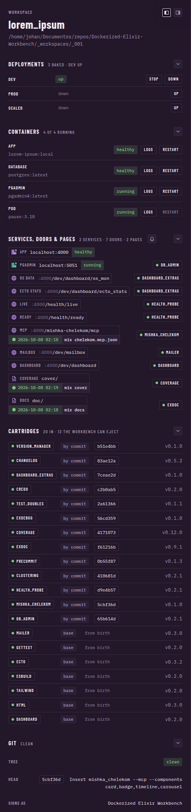

The rail is the state of the workspace at a glance. It stays in view on every tab. From top to bottom:

- **Workspace.** The project's name and the directory it lives in. The two squares move the rail to the other side, and its edge drags to resize it.
- **Deployments.** The three deployments, which one is up, and the buttons to bring each up, stop it or take it down.
- **Containers.** Every container of the deployment that is up, with its health, its logs and a restart.
- **Services, doors & pages.** Everything you can open in a browser. A *service* is a published container (the app, pgAdmin). A *door* is a route a cartridge opened in the app (`/health/live`, the dev mailbox, LiveDashboard). A *page* is something the project generates on disk, like the ExDoc site, with a button to build it. Each one names the cartridge it comes from, and the bell calls every door once to check that it answers.
- **Cartridges.** What the project carries. A cartridge inserted by `add` shows its commit, which is what `eject` reverts. A base cartridge shows that it came with the project.
- **Git.** Whether the tree is clean, the last commit, and who the workbench signs commits as.

Every section folds. A button that cannot be used is still shown, disabled, and its tooltip says why.

The small plates on the rail are a notation the whole console uses, on the Deploy, Logs, Terminal and Docker screens too. The drawing says what kind of address it is, the colour says what the service is for, and the dot says where a cartridge is.

A cartridge's service gets its colour from the role the cartridge declares, not from its name, so a service the console has never heard of is still drawn correctly.

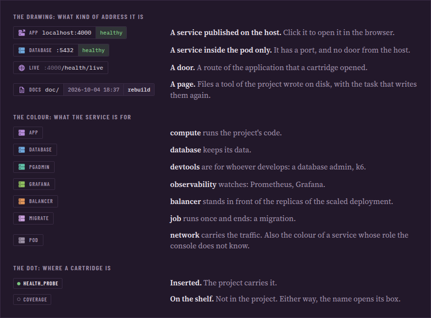

### Deploy

The first tab. It has three cards: one to create the project, one to run it and one to delete it.

#### Create a new project <!-- omit in toc -->

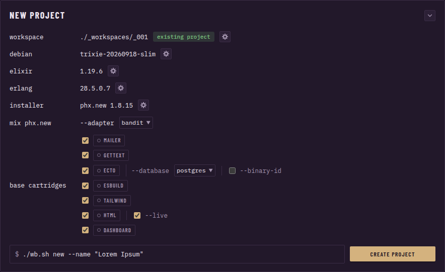

The card shows what `config.conf` says the next project will get: the workspace, the stack and the Phoenix installer. Each gear opens that setting in the workbench's drawer, which [Settings](#settings) describes. Below them are the flags of `mix phx.new`, drawn as what they are, [base cartridges](#base-cartridges-collections-archived-and-pending-boxes): untick `mailer` and the project is born without Swoosh, which is `--no-mailer`.

The line at the bottom is the exact command the button runs, and it changes as you tick. **Create project** generates a stock Phoenix project, adds the few things the workspace needs to boot it (the endpoint bound to `0.0.0.0`, a `.env` file), bakes the three compose files and makes the first commit. It takes about a minute once the image exists.

> From a shell: `./wb.sh new --name "Lorem Ipsum" [any mix phx.new flag]`

#### Deployment <!-- omit in toc -->

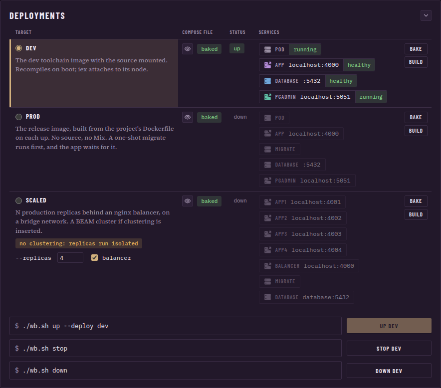

One row per [deployment](#deployments). Each row shows whether its compose file is baked (the eye opens the file under the row), whether it is up, and the services the file declares with the address each one answers on. With the deployment up, every service also shows what Docker says of it.

Pick a row and use the buttons under the table: **Up**, **Stop** (containers kept, for a fast restart) and **Down** (containers removed, data volumes kept). **Bake** writes the compose file again and **Build** rebuilds the image without deploying. The scaled row takes its two options here: the number of replicas and whether nginx stands in front. It also warns that without the `clustering` cartridge the replicas run isolated, which is a valid deployment for a stateless application but not a cluster.

One deployment is up at a time: bringing another up takes the current one down first.

> From a shell: `./wb.sh up [--deploy dev|prod|scaled]`, then `stop`, `down`, `bake`, `build`

#### Delete project <!-- omit in toc -->

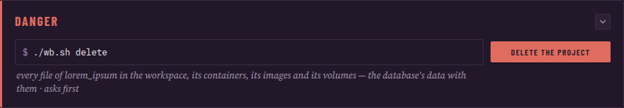

Deletes every file of the project in the workspace, with its containers, images and volumes, the database's data included. It cannot be undone, so the job waits in the Jobs tab until you confirm it.

> From a shell: `./wb.sh delete`

### Jobs

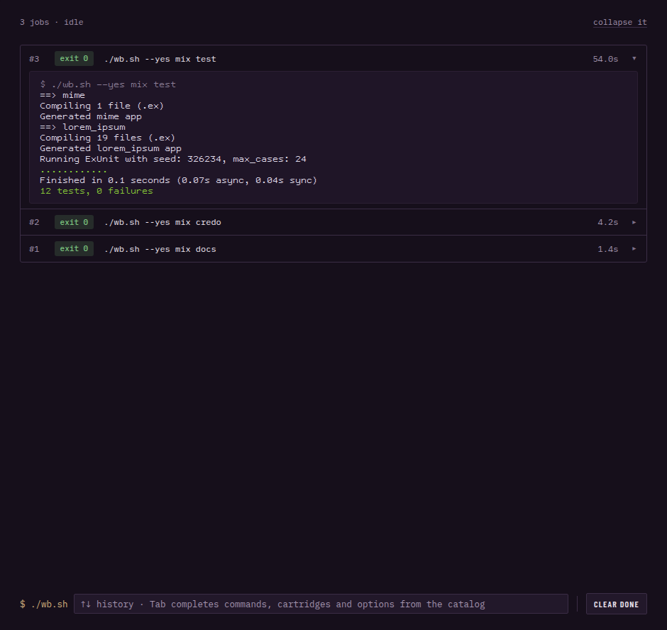

Every action in the console that runs `wb.sh` becomes a **job**: one command, run one at a time, with its output streamed live and its exit code and duration kept. This tab is the list, newest first, and clicking a job unfolds what it printed, in the colours mix, git and Docker gave it.

The line at the bottom is `wb.sh` itself: type any command (`mix test`, `add credo`, `up --deploy prod`), with history on the arrows and Tab completing commands, cartridge names and options from the catalog.

The three jobs in the screenshot were typed there: the docs build, Credo and the test suite, each run inside the app container.

### Logs

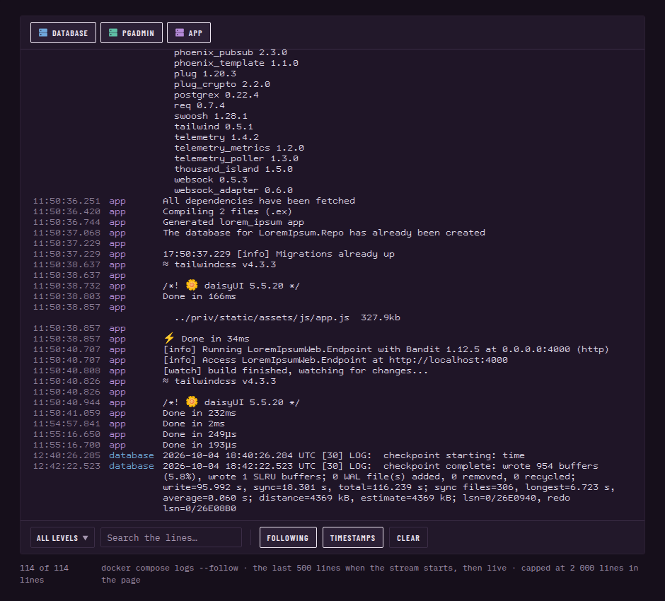

The logs of the deployment that is up, all services merged and each line tagged with the one that wrote it. This is `docker compose logs --follow` with controls: the chips at the top show or hide a service, and the bar at the bottom filters by level, searches the lines, pauses the following and toggles timestamps.

> From a shell: `./wb.sh logs [SERVICE...]`

### Terminal

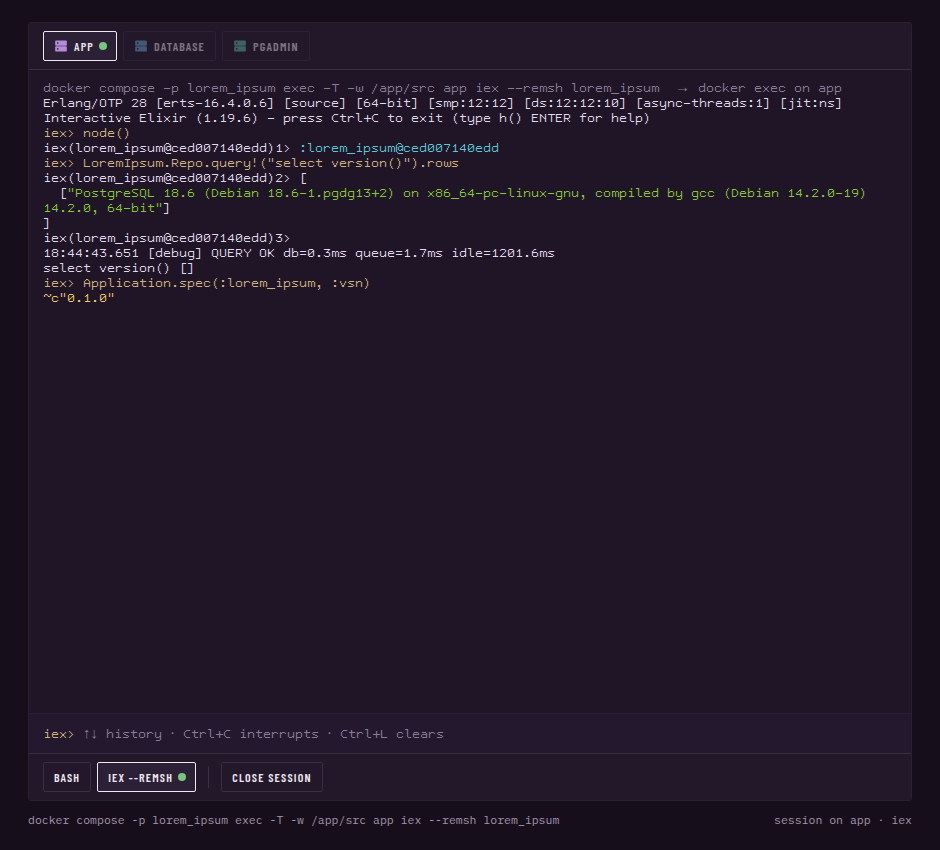

A shell on a running container. Pick the container at the top (the app, the database, any service a cartridge brought), pick **bash** or **iex --remsh**, and open a session.

IEx attaches to the node that is serving the application, so what you evaluate happens on the live system: the query in the screenshot runs through the app's own `Repo`. The terminal is line-oriented (it sends a line and prints what comes back), with history on the arrows, Ctrl+C to interrupt and Ctrl+L to clear.

> From a shell: `./wb.sh iex`, `./wb.sh bash [SERVICE]`

### Project

What the project is, read from the project itself: its git history, its `mix.exs`, its files. The tab has seven papers.

#### Birth <!-- omit in toc -->

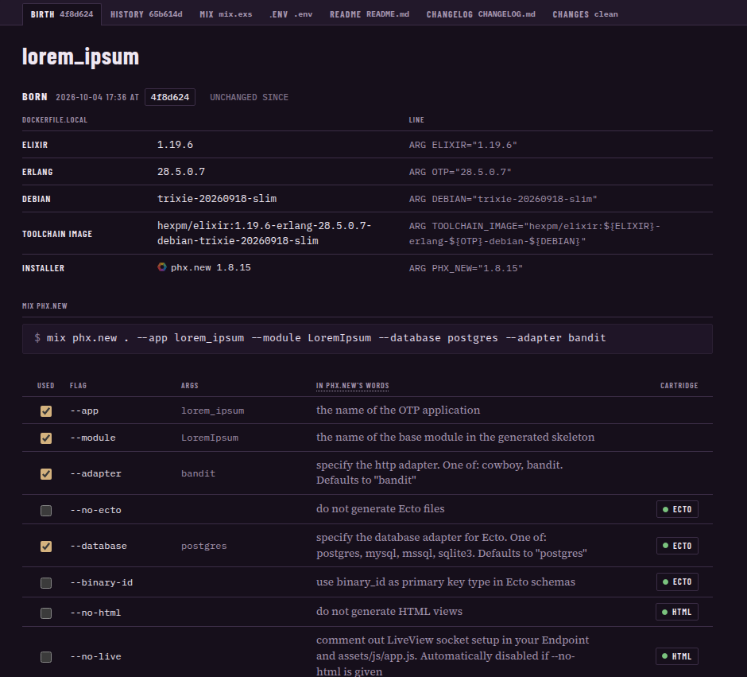

How the project was created, reconstructed from its first commit. It shows the stack in its `Dockerfile.local`, the Phoenix installer version and the exact `mix phx.new` command, then every flag of `phx.new` with the installer's own description, whether this project used it, and the base cartridge that owns it. A teammate who joins later can see how the project started without asking anyone.

#### History <!-- omit in toc -->

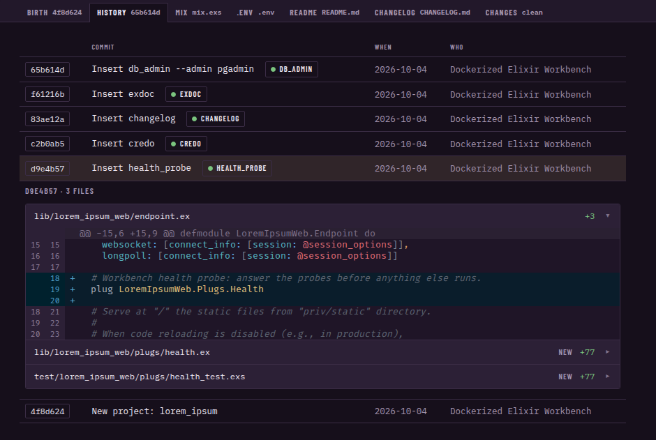

The git log. An insert commit carries the badge of its cartridge, which opens its box. Click a commit to see its files, and a file to see its diff, with syntax highlighting. In the screenshot, the three lines `health_probe` added to the endpoint.

#### Mix <!-- omit in toc -->

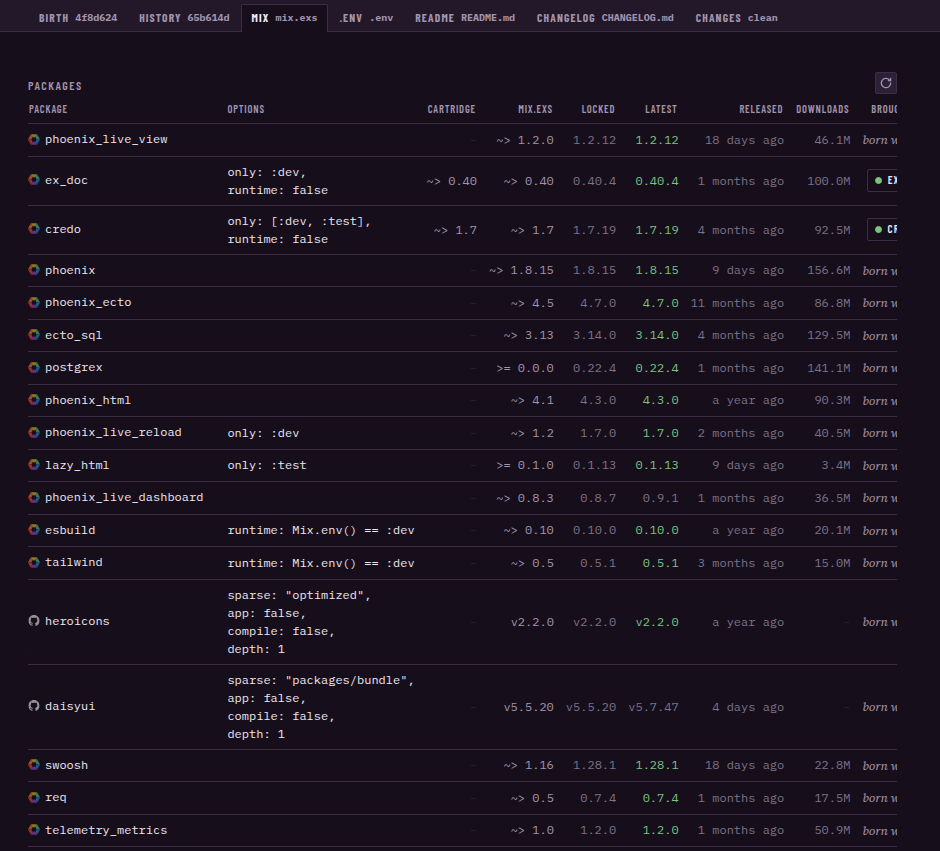

The dependencies of `mix.exs` as a table: the requirement, the version locked in `mix.lock`, and who brought the package (the project at birth, or a cartridge). The button at the top right asks hex.pm for each package's latest version, release date and downloads, so an outdated dependency is visible at a glance.

#### .env <!-- omit in toc -->

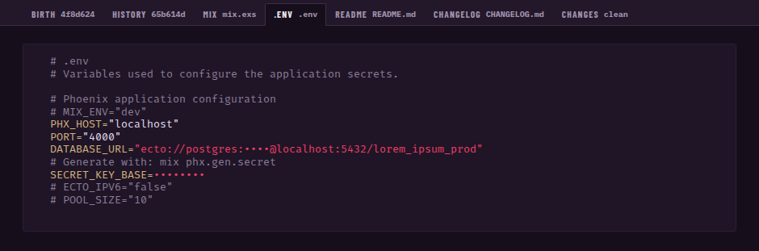

The project's `.env`, the file its compose files load. Secrets are masked before they leave the server.

#### README.md and CHANGELOG.md <!-- omit in toc -->

The project's own README and its changelog, each rendered as a paper, the changelog with an outline to jump between versions. A stock Phoenix project has no changelog, so that paper is shown disabled until there is a file. In this session it appeared when the `changelog` cartridge was inserted.

#### Changes <!-- omit in toc -->

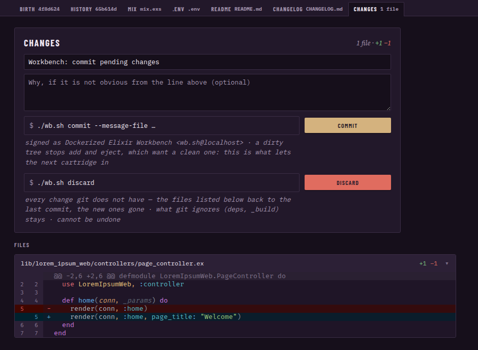

What changed since the last commit, as diffs, with a message field and two buttons: **Commit** and **Discard**. `add` and `eject` need a clean tree, because a cartridge's commit must contain the cartridge and nothing else. This paper is where you get one.

> From a shell: `./wb.sh commit [MESSAGE]`, `./wb.sh discard`

### The Cartridges tab

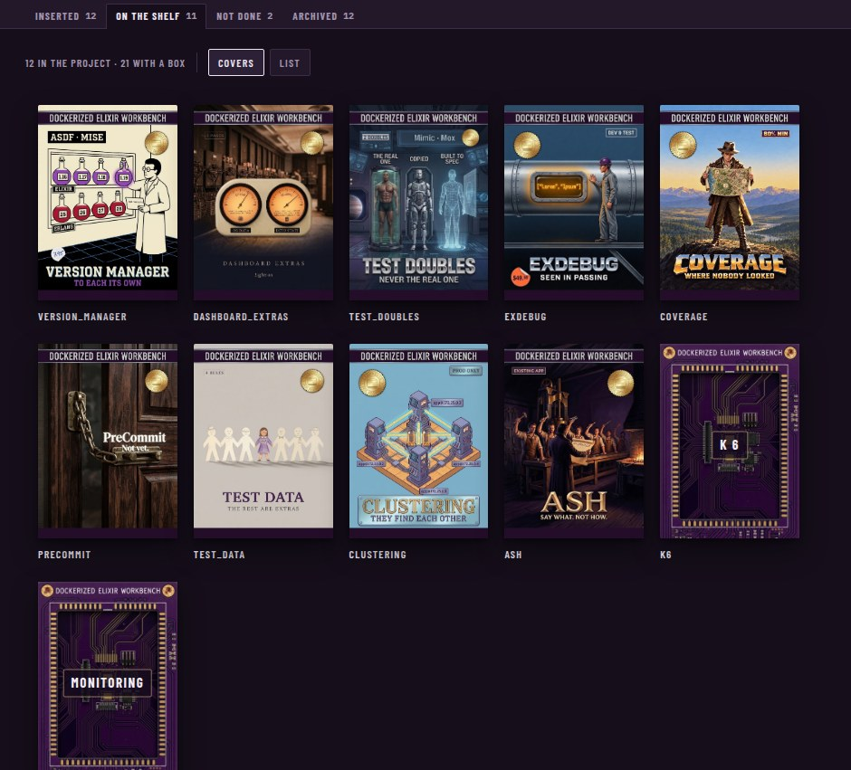

The [shelf](#the-shelf), live. The ribbon splits it in four: **Inserted** (what this project carries), **On the shelf** (what it can take), **Not done** (pending) and **Archived**. It can be seen as covers or as a list. Clicking a box takes it in hand and opens it on four screens.

#### Box <!-- omit in toc -->

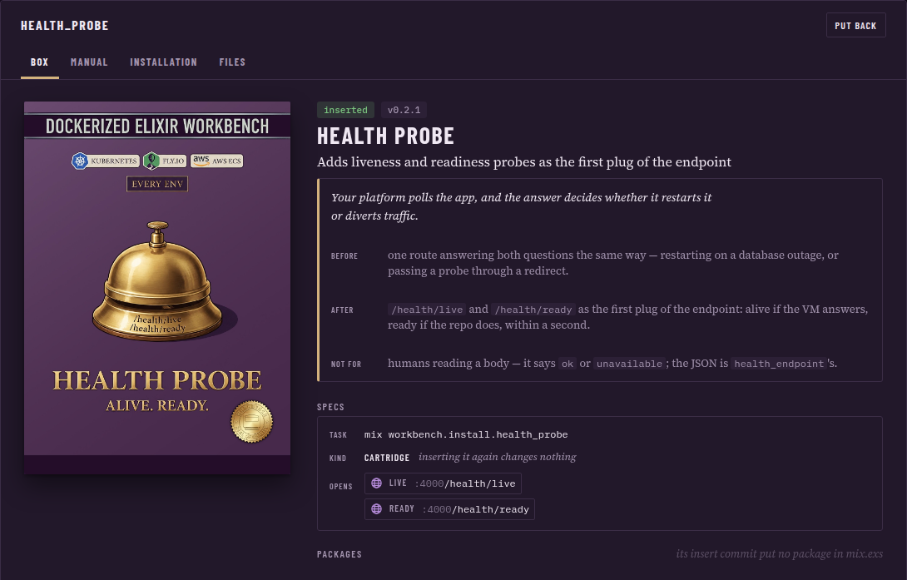

The front of the box: the cover, the one-line summary, and the [`NEED.md`](#the-papers) with its *Before*, *After* and *Not for*. Below, the specifications: the Mix task that installs it, the doors it opens, the packages it adds with their versions.

#### Manual <!-- omit in toc -->

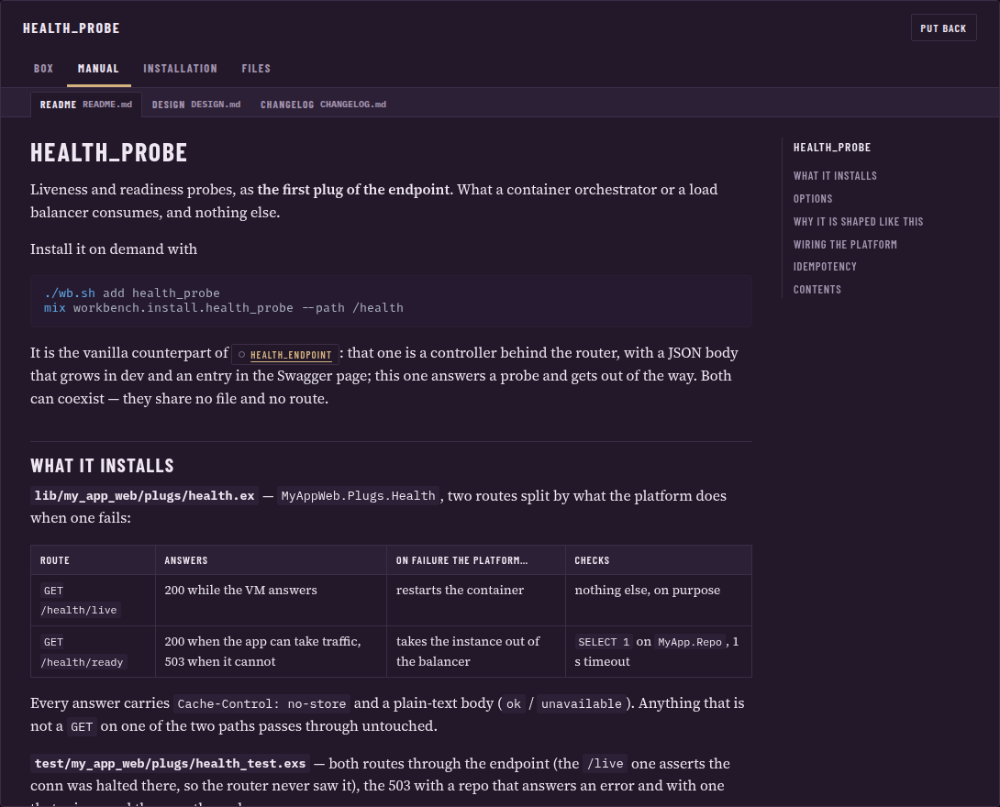

The cartridge's papers, rendered: README, DESIGN and CHANGELOG. This is where the knowledge base is read. It works the same before inserting, to decide whether you want the cartridge, and long after, to remember how the thing it installed works.

#### Installation <!-- omit in toc -->

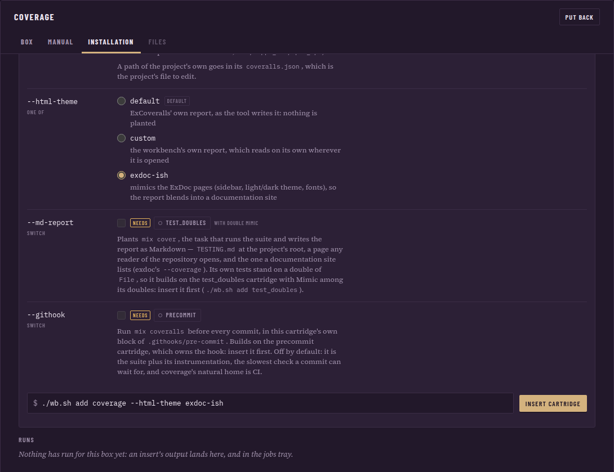

The cartridge's options as a form, generated from its manifest, each with its documentation. An option that does not apply to this project is shown disabled with the reason: in the screenshot, coverage's `--md-report` needs the `test_doubles` cartridge and `--githook` needs `precommit`, and each badge opens the box that is missing. As on the New Project card, the command line follows the form, and **Insert cartridge** runs it as a job whose output lands on this same screen.

Once inserted, the button becomes **Eject** and the options show what the cartridge went in with.

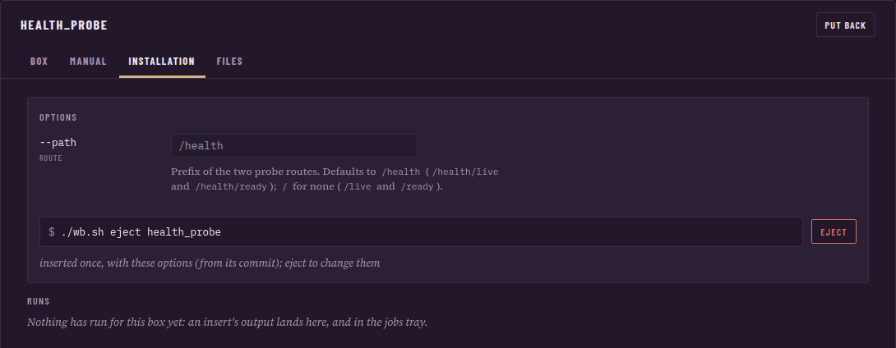

> From a shell: `./wb.sh add coverage --html-theme exdoc-ish`, `./wb.sh eject health_probe`

#### Files <!-- omit in toc -->

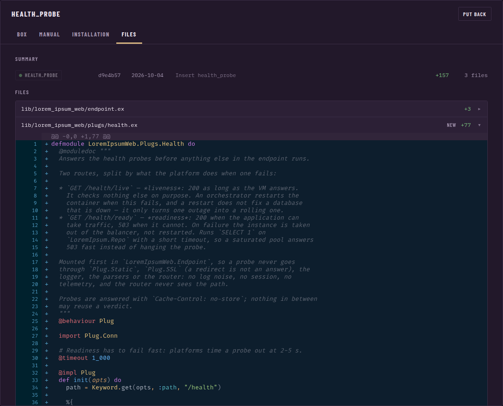

What the cartridge wrote in *this* project, read from its insert commit: every file, as a diff. The Manual explains the idea and this screen shows the code that implements it, in your project, with your module names.

### Docker

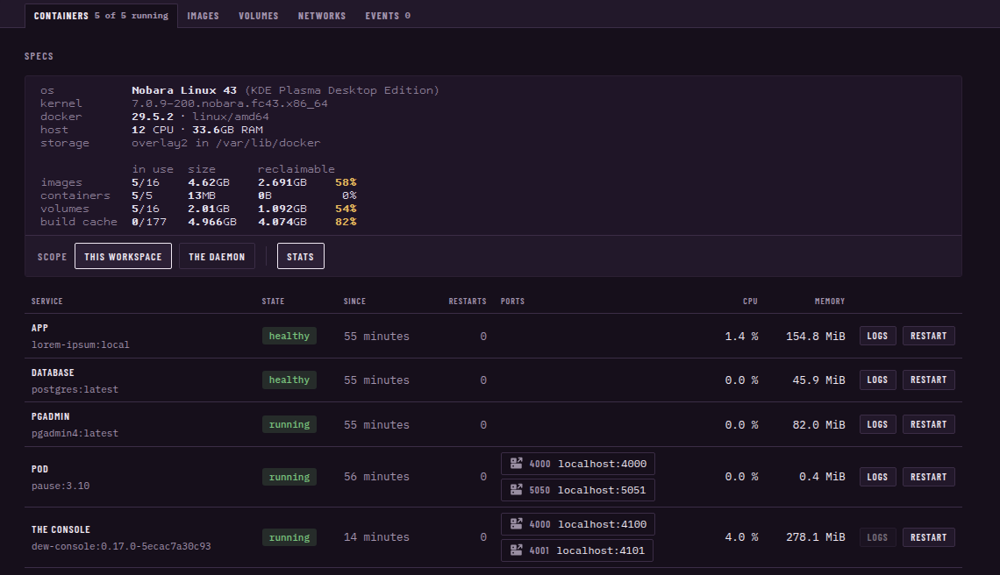

Docker as the workbench sees it: **Containers**, **Images**, **Volumes**, **Networks** and **Events**. Each list can be scoped to this workspace or to the whole daemon, which is how leftovers from old workspaces are found. Containers show live CPU and memory, and the other lists offer `./wb.sh prune` for what nothing uses any more.

### Settings

The last stop of the tour is not a tab. The gear on the band opens the workbench's drawer, with three tabs of its own. Its **Config** tab is `config.conf` as a form: the same settings as in [Configuration](#configuration), each with the file's own comment as its help. Saving runs `./wb.sh config set`, which rewrites the values in place and keeps the comments.

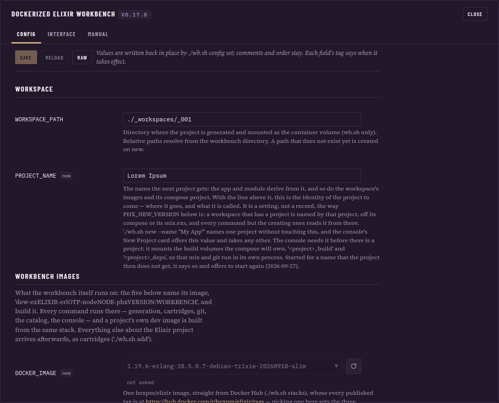

#### Choosing versions  <!-- omit in toc -->

Three of those settings are versions of things published somewhere else, and a version typed from memory is how a build fails ten minutes in. Each of the three has a refresh button beside it that asks the source and turns the field into a list of what really exists. None of them chooses for you, and `config.conf` keeps your choice and no copy of the lists.

**The stack** (`DOCKER_IMAGE`) asks Docker Hub for the [`hexpm/elixir`](https://hub.docker.com/r/hexpm/elixir/tags) images the workbench can build on: Debian slim, no release candidates, grouped by Elixir version. The problem it solves is one of combination. Elixir, Erlang and Debian are three versions, but only certain triples were ever published as an image. Picking an image sets the three fields below it at once, and changing one of the three by hand looks the image up again and says whether it is published.

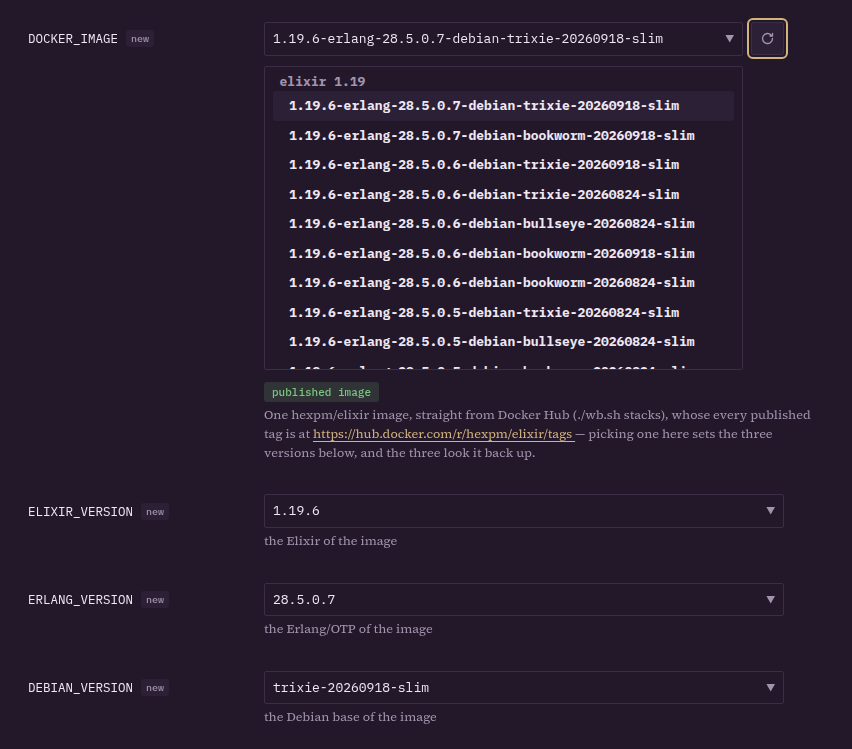

> From a shell: `./wb.sh stacks`, `./wb.sh stacks use TAG`

**The Phoenix installer** (`PHX_NEW_VERSION`) asks hex for the `phx_new` releases and the Elixir each one requires, grouped by that requirement, with the Elixir of your stack written under the field. The problem it solves is compatibility: you see which installers your stack can run before anything is generated, and `./wb.sh new` refuses one it cannot run. The first entry of the list leaves the field empty, which means the newest release that runs on the stack.

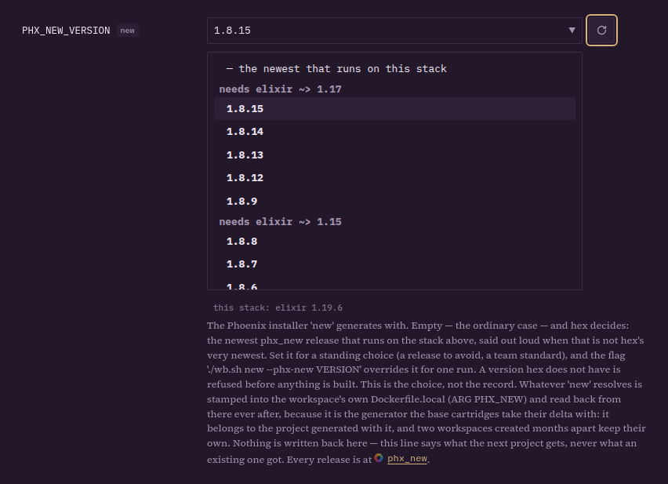

> From a shell: `./wb.sh new --phx-new VERSION`

**Node** (`NODE_VERSION`) asks two sources. Node's own release schedule says where each major stands (current, LTS, maintenance or end of life, and until when), and NodeSource says whether that major can be installed in the image at all. The problem it solves is picking a major that is both supported and installable: in the list below, Node 19 is marked as not on NodeSource.

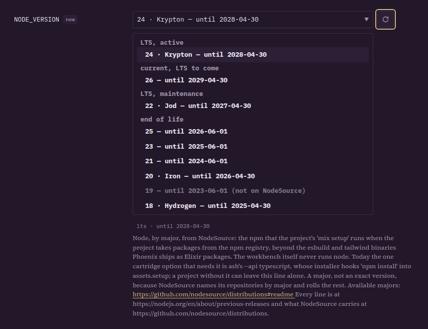

The workbench itself never runs Node, and Phoenix ships esbuild and Tailwind as Elixir packages, so most projects can leave this field alone. It matters only when a project takes packages from npm. Today one cartridge option does: `ash`'s `--api typescript` (`ash_typescript`), the one a React or any other TypeScript front end is built on.

In the three screenshots the list is drawn open under its field and the button that asks is outlined.

#### Interface <!-- omit in toc -->

The **Interface** tab sets how the console looks. Unlike Config, what you set here belongs to your browser: it is kept in `localStorage`, never in `config.conf`, so it survives a restart or a rebuild of the console and does not travel to another browser or machine. It has four parts, each with a live sample beside its controls.

**Overlay** arranges the frame: the band on top or at the bottom, the rail on the left, on the right or hidden, and the ground light, dark or whatever the system says.

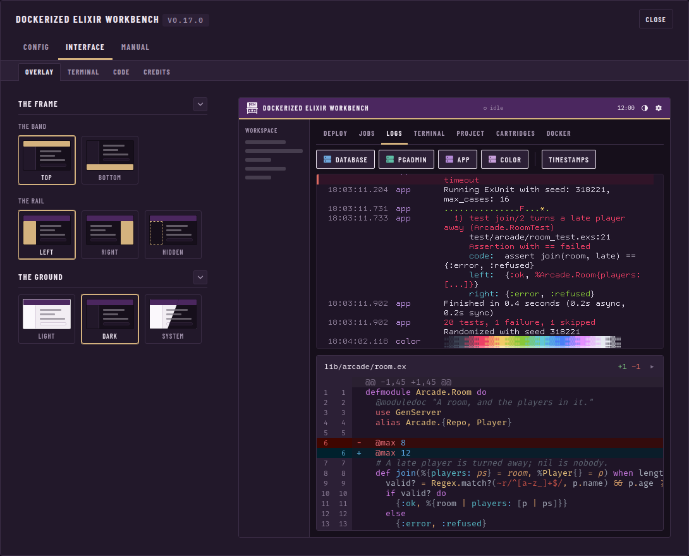

**Terminal** and **Code** are the two surfaces that carry colour: the output of commands and logs, and the source in diffs. Each takes a theme from a file in `console/themes/` (`<name>.terminal.json` or `<name>.code.json`), written with the same keys VS Code themes use. Dropping a file there and reloading the page adds it to the list, with no image to rebuild. Every colour can also be adjusted on its own, beside a sample that shows it as it lands.

| The terminal's theme | The code's theme |
| --- | --- |
| 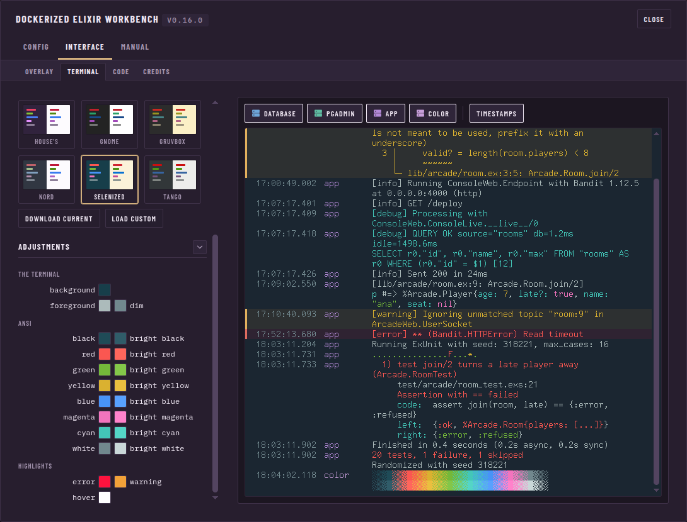 | 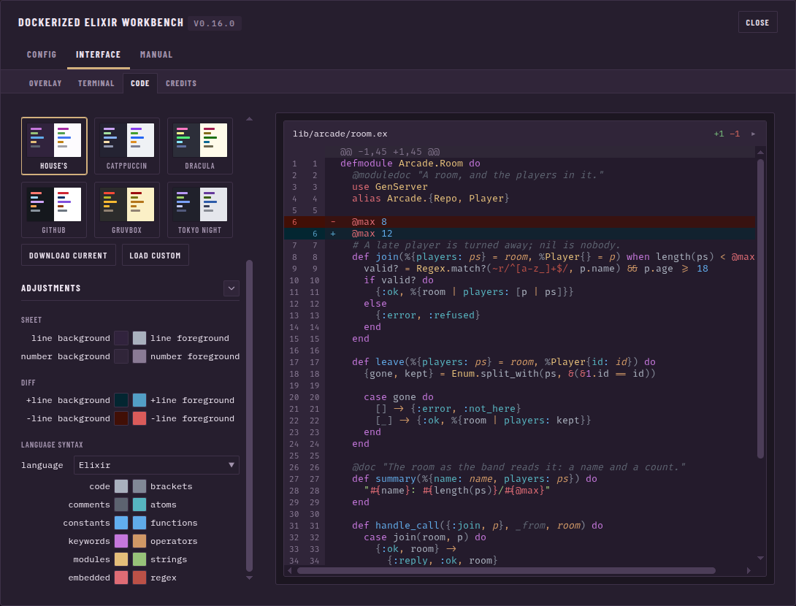 |

**Credits** lists every typeface and every theme the console draws with: whose it is, where it comes from and under which licence.

The third tab of the drawer, **Manual**, holds the workbench's own README and CHANGELOG.

---

## Writing a cartridge

Using cartridges is half of the knowledge base. The other half is writing your own: when you work out how to set something up in Phoenix, you can keep it as a cartridge instead of as a note or a gist.

### By hand, for now

There is no generator and no form in the console for creating a cartridge yet. You write one by hand, in Elixir, in `igniter/`. Cartridges are part of the workbench's own repository, so your shelf, or your team's, is a fork of it: the cartridges you add travel with the fork, and the ones here keep arriving from upstream. The steps:

1. **Write the need.** `NEED.md`: one sentence, then *Before*, *After*, *Not for*. If you cannot write it, the cartridge is not clear yet.
2. **Do the research and write it down.** `DESIGN.md`: the problem, the sources, the decisions and the alternatives they beat. [How to write one](igniter/lib/workbench_igniter/features/README.md#writing-a-designmd).
3. **Write the installer.** A module with `use WorkbenchIgniter.Feature` (the manifest and the `install/1` function) and a small Mix task shell, in `igniter/lib/workbench_igniter/features/<name>/`. Templates go in `priv/features/<name>/`. [The anatomy](igniter/README.md#anatomy-of-a-cartridge) and [the manifest](igniter/lib/workbench_igniter/features/README.md#the-manifest-workbenchigniterfeature-behaviour).
4. **Make it answer for itself.** `installed?/1` reads the same mark the installer checks, so inserting twice changes nothing.
5. **Register it** in `WorkbenchIgniter.Features`, and it appears in the catalog and on the console's shelf.
6. **Test it** with `Igniter.Test` against a generated Phoenix project, then for real: `./wb.sh add <name>` on a workspace.
7. **Write the README and the CHANGELOG**, and optionally give it a cover.

The full checklist is [Adding a feature](igniter/README.md#adding-a-feature-checklist). [credo](igniter/lib/workbench_igniter/features/credo/) is the smallest complete example and [health_probe](igniter/lib/workbench_igniter/features/health_probe/) the reference.

### The box art

A cover is optional: a cartridge works without one and shows a placeholder, as `k6` and `monitoring` do above. But the part of cartridge authoring that *is* already assisted is this one.

The covers are generated with an image model, and the repository keeps the whole process rather than only the results. It has three parts:

- **A Claude Code skill**, [`.claude/skills/cartridge-covers/`](.claude/skills/cartridge-covers/SKILL.md). Open the repository in [Claude Code](https://claude.com/claude-code) and ask for a cover. The skill reads the cartridge's `NEED.md` and README, proposes six concepts in six different visual eras, and writes the chosen one as a prompt file in `assets/covers/<name>/`.
- **You.** The skill does not generate images. You take the prompt to an image generator, and bring the result back. The skill then checks it against the prompt and the rules every cover follows.
- **A script**, [`assets/covers/covers.py`](assets/covers/covers.py), for everything that must be exact: fitting the art to the 5:7 face, laying the workbench's banner over it and stamping the seal.

| 1. The hero, generated | 2. Padded to the face | 3. Margins painted, second turn | 4. Cut, banner and seal |
| :-: | :-: | :-: | :-: |
|  | 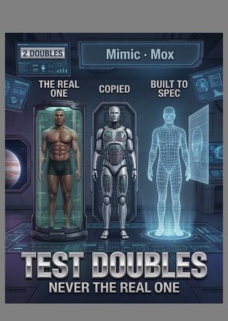 |  |  |

The record of every cover, with what each attempt taught, is [`assets/covers/README.md`](assets/covers/README.md).

---

## Why it is shaped like this

For the reader who wants the decisions rather than the tour:

- **Cartridges patch the AST, and are one commit each.** Igniter installers compose and stay idempotent where `sed` scripts do not, and a commit per insert makes each one readable, revertible and attributable. [igniter/README.md](igniter/README.md).
- **A `phx.new` capability can be added after the fact.** `WorkbenchIgniter.PhxDelta` generates the project twice, with and without a flag, at the project's own installer version, and three-way merges the difference. It is how `add ecto` or `add html` work on a project born without them. [ecto/DESIGN.md](igniter/lib/workbench_igniter/features/ecto/DESIGN.md).
- **One compose per workspace, and a pod inside it.** A project owns its orchestration, so several run at once, and the shared network namespace keeps Phoenix's `localhost` configuration untouched.
- **A compose service belongs to its cartridge.** Nothing outside a cartridge names its service. The same insert serves dev, prod and scaled because the cartridge declares the service and the bake writes the topology.
- **The project owes the workbench nothing.** No route, file or marker exists in a project only for the workbench to read. The console reads what is already there: the source, Docker and git. A project can leave at any time by simply not using `wb.sh`.
- **The console does not reimplement the workbench.** It runs `wb.sh` as jobs and reads its JSON contracts. What only the project can answer is asked of one long-lived BEAM with the project loaded. [console/README.md](console/README.md).
- **It is tested the way it is used.** Each cartridge has a test that runs its installer on a generated Phoenix project, and runs it twice to show the second run changes nothing. The base cartridges get a harder one: a project born bare and grown cartridge by cartridge has to equal, file by file, the project born whole. The compose files are compared byte for byte with golden copies. That is close to 700 tests in `igniter/` and close to 400 in `console/`, and every push also runs ShellCheck, the formatter, Credo in strict mode and Dialyzer.
- **The record is the CHANGELOG**: what was done and why, decision by decision. [CHANGELOG.md](CHANGELOG.md).

None of these was free. What each decision costs:

| Decision | What it costs |
| --- | --- |
| **The pod**: every service in one network namespace | The application has to listen on `0.0.0.0`, because a published port arrives on the pod's interface and never on loopback. It is the one line of a stock project's configuration the workbench changes. And the pod does not scale: replicas sharing a namespace would share one address and one port, so the scaled deployment is a second topology, on a bridge network, with the database reached by name. |
| **One kind of cartridge**: a collection is a cartridge too | A collection leaves no commit of its own and may not re-expose a member's option. Whoever wants a member configured differently inserts that member directly. |
| **The resident**: a second BEAM with the project loaded | It is compiled into a volume of its own: a second incremental compile of whatever an insert changed, a build's worth of disk per workspace, and a console bound to the workspace it was started for. Pointing it at another means starting it again. |
| **One commit per cartridge**, and ejecting is reverting it | `add` and `eject` need a clean tree, and an option cannot be changed in place: the cartridge is ejected and inserted again. |
| **One compose per workspace**, its ports written at creation | A hand edit to a compose file lasts until the next bake, unless it goes in the override file. Changing a port is editing that file. |
| **Base cartridges by difference**: generate twice and merge | The project has to remember the Phoenix installer it was born with, and the workbench has to be able to run that version again. |
| **`wb.sh` in bash**, the one implementation of every command | About 3,500 lines of bash. It is what lets the host need nothing but Docker and a shell. |
| **The project owes the workbench nothing** | The workbench has to work everything out by reading: the source, Docker and git. |
| **Cartridges live in the workbench's repository** | A shelf of your own, or your team's, is a fork. |

What I would do differently is not written yet. None of these decisions has broken badly enough to say, and this section will grow as they do.

The implementation was AI-assisted. The architecture and the decisions are the author's, and the [CHANGELOG](CHANGELOG.md) is where each one was argued.

## Maintenance

Every push runs the checks in `.github/workflows/ci.yml`. To run them before pushing:

```sh
shellcheck -x wb.sh scripts/entrypoint.sh
cd igniter && mix format --check-formatted && mix credo --strict && mix dialyzer && mix test
cd console && mix assets.build && mix format --check-formatted && mix credo --strict && mix dialyzer --force-check && mix test
```

Each package pins its Erlang and Elixir in its own `.tool-versions`. The first `mix dialyzer` builds its PLT, which takes a few minutes. The console takes `--force-check` because it carries `igniter/` as a path dependency, and Dialyzer's cache does not notice that one changing.

CI also checks that the two tables of cartridges in this README say what the catalog says. After adding a cartridge, or changing one's version or summary, write them again:

```sh
./wb.sh catalog --json --brief | python3 assets/readme/build.py
```

To pull private images from the GitHub registry, log Docker in with a classic [personal access token](https://docs.github.com/en/authentication/keeping-your-account-and-data-secure/managing-your-personal-access-tokens#creating-a-personal-access-token-classic): `./wb.sh login [GITHUB_USER] [ACCESS_TOKEN]`.

## License

This software is released under the [MIT](https://mit-license.org/) license.

Permission is granted to use, copy, modify, and distribute the code in both commercial and non-commercial projects. It only requires that the copyright notice and permission statement be maintained in all copies. No warranties are provided and the authors bear no liability.

Copyright © 2024-2026 José Luis Pamplona Stoever.
