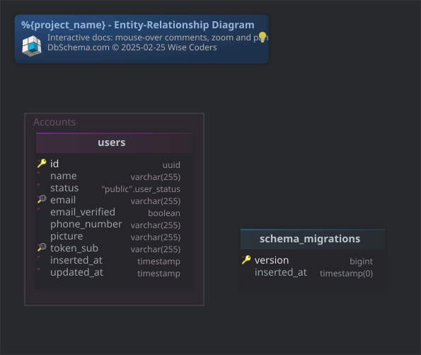

#%{project_name} - Entity-Relationship Diagram
Generated using [DbSchema](https://dbschema.com)

### Main Layout

### Table public.schema_migrations 
|Idx |Name |Data Type |
|---|---|---|
| * &#128273;  | version| bigint  |
|  | inserted\_at| timestamp(0)  |

##### Indexes 
|Type |Name |On |
|---|---|---|
| &#128273;  | schema\_migrations\_pkey | ON version|

### Table public.users 
|Idx |Name |Data Type |
|---|---|---|
| * &#128273;  | id| uuid  |
| * | name| varchar(255)  |
| * | status| "public".user\_status  |
| * &#128269; | email| varchar(255)  |
| * | email\_verified| boolean  DEFAULT false |
|  | phone\_number| varchar(255)  |
|  | picture| varchar(255)  |
| * &#128269; | token\_sub| varchar(255)  |
| * | inserted\_at| timestamp  DEFAULT now() |
| * | updated\_at| timestamp  DEFAULT now() |

##### Indexes 
|Type |Name |On |
|---|---|---|
| &#128273;  | users\_pkey | ON id|
| &#128269;  | users\_token\_sub\_index | ON token\_sub|
| &#128269;  | users\_email\_index | ON email|

