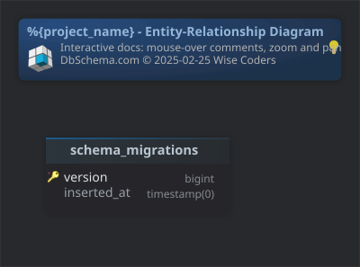

#%{project_name} - Entity-Relationship Diagram
Generated using [DbSchema](https://dbschema.com)

### Main Layout

### Table public.schema_migrations 
|Idx |Name |Data Type |
|---|---|---|
| * &#128273;  | version| bigint  |
|  | inserted\_at| timestamp(0)  |

##### Indexes 
|Type |Name |On |
|---|---|---|
| &#128273;  | schema\_migrations\_pkey | ON version|

