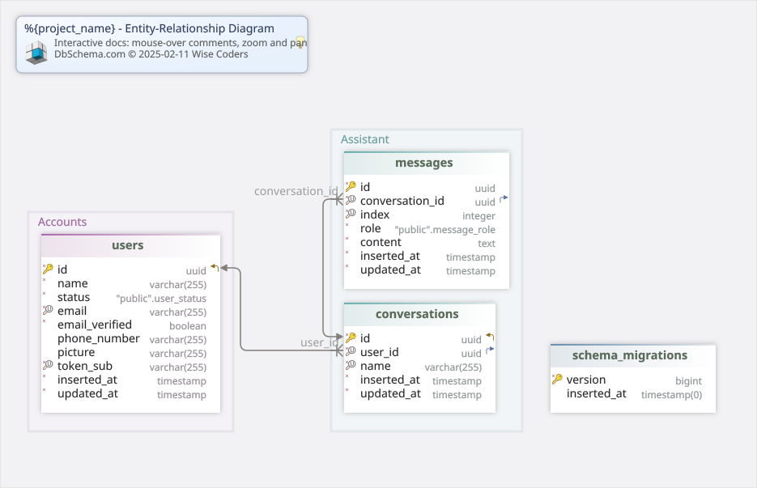

#%{project_name}
Generated using [DbSchema](https://dbschema.com)

### Main Layout

### Table public.conversations 
|Idx |Name |Data Type |
|---|---|---|
| * &#128273;  &#11019; | id| uuid  |
| * &#128269; &#11016; | user\_id| uuid  |
| * &#128269; | name| varchar(255)  |
| * | inserted\_at| timestamp  DEFAULT now() |
| * | updated\_at| timestamp  DEFAULT now() |

##### Indexes 
|Type |Name |On |
|---|---|---|
| &#128273;  | conversations\_pkey | ON id|
| &#128269;  | conversations\_user\_id\_name\_index | ON user\_id, name|

##### Foreign Keys
|Type |Name |On |
|---|---|---|
|  | conversations_user_id_fkey | ( user\_id ) ref [public.users](#users) (id) |

### Table public.messages 
|Idx |Name |Data Type |
|---|---|---|
| * &#128273;  | id| uuid  |
| * &#128269; &#11016; | conversation\_id| uuid  |
| * &#128269; | index| integer  |
| * | role| public.message\_role  |
| * | content| text  |
| * | inserted\_at| timestamp  DEFAULT now() |
| * | updated\_at| timestamp  DEFAULT now() |

##### Indexes 
|Type |Name |On |
|---|---|---|
| &#128273;  | messages\_pkey | ON id|
| &#128269;  | messages\_conversation\_id\_index\_index | ON conversation\_id, index|

##### Foreign Keys
|Type |Name |On |
|---|---|---|
|  | messages_conversation_id_fkey | ( conversation\_id ) ref [public.conversations](#conversations) (id) |

##### Constraints
|Name |Definition |
|---|---|
| index_positive | (index &gt;= 0) |

### Table public.schema_migrations 
|Idx |Name |Data Type |
|---|---|---|
| * &#128273;  | version| bigint  |
|  | inserted\_at| timestamp(0)  |

##### Indexes 
|Type |Name |On |
|---|---|---|
| &#128273;  | schema\_migrations\_pkey | ON version|

### Table public.users 
|Idx |Name |Data Type |
|---|---|---|
| * &#128273;  &#11019; | id| uuid  |
| * | name| varchar(255)  |
| * | status| public.user\_status  |
| * &#128269; | email| varchar(255)  |
| * | email\_verified| boolean  DEFAULT false |
|  | phone\_number| varchar(255)  |
|  | picture| varchar(255)  |
| * &#128269; | token\_sub| varchar(255)  |
| * | inserted\_at| timestamp  DEFAULT now() |
| * | updated\_at| timestamp  DEFAULT now() |

##### Indexes 
|Type |Name |On |
|---|---|---|
| &#128273;  | users\_pkey | ON id|
| &#128269;  | users\_token\_sub\_index | ON token\_sub|
| &#128269;  | users\_email\_index | ON email|

