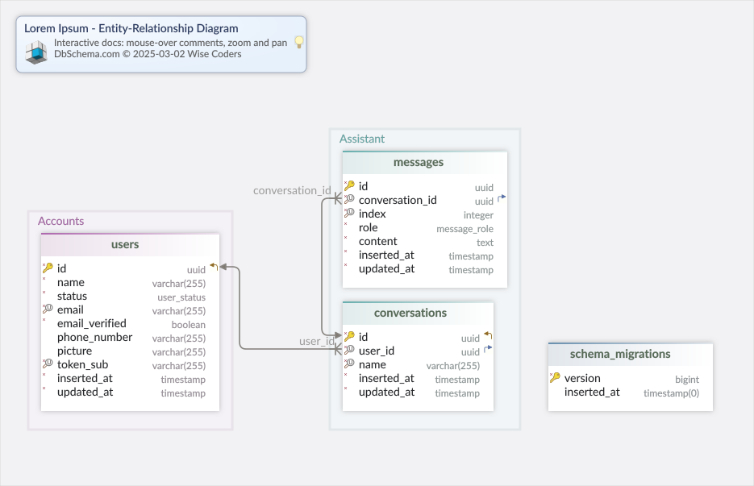

<!-- markdownlint-disable MD024 -->
# Database

Documentation integrated on `2025-03-02` at `06:41:51.660989` for version: **0.0.0**.

<!-- tabs-close -->

## conversations

<!-- tabs-open -->

### Schema

|Idx |Name |Data Type |
|---|---|---|
| * 🔑  ⬋ | id | `uuid` |
| * 🔍 ⬈ | user_id | `uuid` |
| * 🔍 | name | `varchar(255)` |
| * | inserted_at | `timestamp  DEFAULT now()` |
| * | updated_at | `timestamp  DEFAULT now()` |

### Indexes

|Type |Name |On |
|---|---|---|
| 🔑 | conversations_pkey | `ON id` |
| 🔍 | conversations_user_id_name_index | `ON user_id, name` |

### Foreign Keys

|Type |Name |On |
|---|---|---|
|  | conversations_user_id_fkey | `( user_id ) ref users (id)` |

<!-- tabs-close -->

## messages

<!-- tabs-open -->

### Schema

|Idx |Name |Data Type |
|---|---|---|
| * 🔑 | id | `uuid` |
| * 🔍 ⬈ | conversation_id | `uuid` |
| * 🔍 | index | `integer` |
| * | role | `message_role` |
| * | content | `text` |
| * | inserted_at | `timestamp  DEFAULT now()` |
| * | updated_at | `timestamp  DEFAULT now()` |

### Indexes

|Type |Name |On |
|---|---|---|
| 🔑 | messages_pkey | `ON id` |
| 🔍 | messages_conversation_id_index_index | `ON conversation_id, index` |

### Foreign Keys

|Type |Name |On |
|---|---|---|
|  | messages_conversation_id_fkey | `( conversation_id ) ref conversations (id)` |

### Constraints

|Name |Definition |
|---|---|
| index_positive | `(index >= 0)` |

<!-- tabs-close -->

## schema_migrations

<!-- tabs-open -->

### Schema

|Idx |Name |Data Type |
|---|---|---|
| * 🔑 | version | `bigint` |
|  | inserted_at | `timestamp(0)` |

### Indexes

|Type |Name |On |
|---|---|---|
| 🔑 | schema_migrations_pkey | `ON version` |

<!-- tabs-close -->

## users

<!-- tabs-open -->

### Schema

|Idx |Name |Data Type |
|---|---|---|
| * 🔑  ⬋ | id | `uuid` |
| * | name | `varchar(255)` |
| * | status | `user_status` |
| * 🔍 | email | `varchar(255)` |
| * | email_verified | `boolean  DEFAULT false` |
|  | phone_number | `varchar(255)` |
|  | picture | `varchar(255)` |
| * 🔍 | token_sub | `varchar(255)` |
| * | inserted_at | `timestamp  DEFAULT now()` |
| * | updated_at | `timestamp  DEFAULT now()` |

### Indexes

|Type |Name |On |
|---|---|---|
| 🔑 | users_pkey | `ON id` |
| 🔍 | users_token_sub_index | `ON token_sub` |
| 🔍 | users_email_index | `ON email` |

<!-- tabs-close -->
